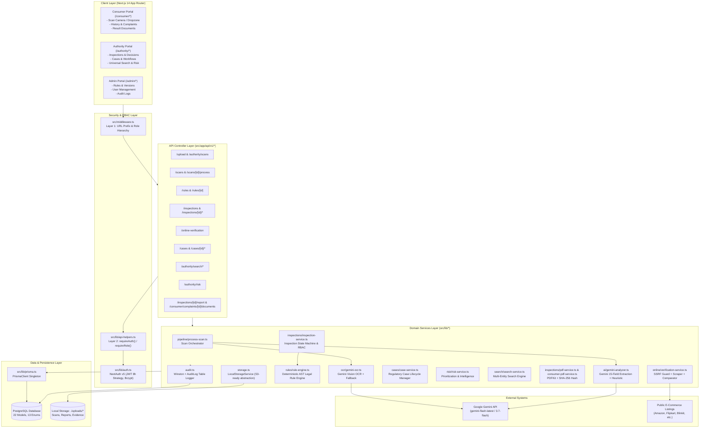
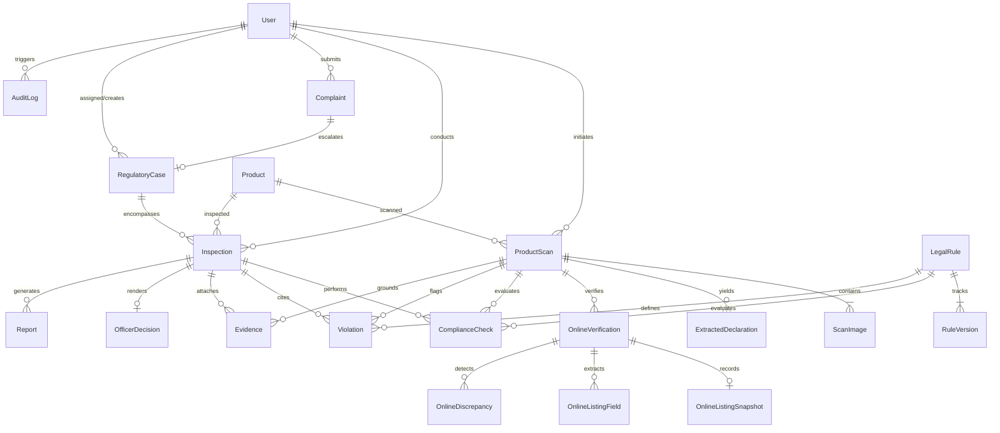
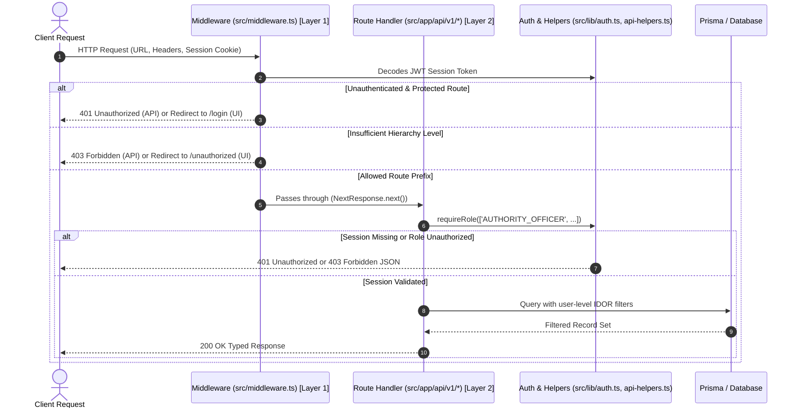

# VeriQO — Comprehensive Backend Architecture Audit & PS107 Extension Roadmap
**Document Reference**: `docs/PS107_BACKEND_ANALYSIS.md`  
**Role**: Dev 2 — Backend Developer + Integration Owner  
**Current Branch**: `feature/ps107-backend`  
**Date**: September 2026  
**Status**: Pre-Implementation Backend Audit (No application code modified)

---

## Executive Summary

VeriQO is a production-grade regulatory compliance platform originally developed for verifying packaged commodities against the **Legal Metrology Act, 2009** and the **Legal Metrology (Packaged Commodities) Rules, 2011 (LMPC)**. The platform encompasses a complete, multi-tiered architecture with dual-layer Role-Based Access Control (RBAC), multi-engine OCR and AI extraction via Google Gemini, a deterministic AST-based legal rule engine, e-commerce online verification with SSRF protection, regulatory case management, cryptographic PDF report generation, and complete audit logging.

Under **Smart India Hackathon (SIH) 2026 Problem Statement 107 (PS107)**, VeriQO is being extended into an **AI-powered intelligent assistant for Indian Standards and Bureau of Indian Standards (BIS) services**. 

This document provides a complete technical audit of the existing backend, maps the active data flow across every layer, details reusable modules, identifies inviolable vs. extensible files, formalizes PS107 functional requirements, and defines the proposed PS107 API and service architecture while guaranteeing that zero existing LMPC and authority inspection features are disrupted.

---

## A. Current Architecture

### 1. High-Level Architectural Diagram



---

### 2. End-to-End Data Flow Mapping (Current Production Implementation)

The table below traces the exact file-by-file execution for the platform's primary pipeline: **Product Packaging Scan $\to$ OCR $\to$ AI Declaration Extraction $\to$ Legal Rule Compliance Analysis $\to$ Formal Decision $\to$ Cryptographic PDF Report Generation**.

| Step | Layer | Action / Responsibility | Concrete Source Files Responsible |
| :--- | :--- | :--- | :--- |
| **1. Ingestion** | Frontend | User drops packaging images (1–10 images, max 20MB, JPG/PNG/WebP/HEIC) and clicks "Start Verification". | [`src/app/(consumer)/consumer/scan/page.tsx`](file:///c:/Users/himan/Desktop/VeriQO/src/app/(consumer)/consumer/scan/page.tsx)<br>[`src/app/(authority)/authority/scan/page.tsx`](file:///c:/Users/himan/Desktop/VeriQO/src/app/(authority)/authority/scan/page.tsx) |
| **2. Upload Controller** | Backend | Layer 2 RBAC check; validates MIME types; creates `ProductScan` (PENDING); writes image buffers to disk; creates `ScanImage` records; logs `FILE_UPLOAD`. | [`src/app/api/v1/upload/route.ts`](file:///c:/Users/himan/Desktop/VeriQO/src/app/api/v1/upload/route.ts)<br>[`src/app/api/v1/authority/scans/route.ts`](file:///c:/Users/himan/Desktop/VeriQO/src/app/api/v1/authority/scans/route.ts)<br>[`src/lib/storage.ts`](file:///c:/Users/himan/Desktop/VeriQO/src/lib/storage.ts) |
| **3. Processing Trigger** | Frontend $\to$ Backend | Client initiates processing trigger `POST /api/v1/scans/{id}/process` with live progress UI state. | [`src/app/api/v1/scans/[id]/process/route.ts`](file:///c:/Users/himan/Desktop/VeriQO/src/app/api/v1/scans/[id]/process/route.ts)<br>[`src/app/api/v1/authority/scans/[id]/process/route.ts`](file:///c:/Users/himan/Desktop/VeriQO/src/app/api/v1/authority/scans/[id]/process/route.ts) |
| **4. Pipeline Orchestration** | Service Orchestrator | Updates scan status to `PROCESSING`; loads image buffers from storage; coordinates OCR and AI execution. | [`src/lib/pipeline/process-scan.ts`](file:///c:/Users/himan/Desktop/VeriQO/src/lib/pipeline/process-scan.ts) (`processScan()`) |
| **5. OCR Extraction** | AI / Vision | Dispatches base64 image buffers to Gemini Vision with temperature 0.0; transcribes all packaging panels; updates `ScanImage.ocrText`; aggregates into `rawOcrText`. | [`src/lib/ocr/gemini-ocr.ts`](file:///c:/Users/himan/Desktop/VeriQO/src/lib/ocr/gemini-ocr.ts) (`GeminiOcrProvider`)<br>[`src/lib/ocr/fallback-ocr.ts`](file:///c:/Users/himan/Desktop/VeriQO/src/lib/ocr/fallback-ocr.ts) (`FallbackOcrProvider`) |
| **6. AI Declaration Extraction** | AI / GenAI | Evaluates text against 15 mandatory statutory fields; extracts raw values, normalized values, exact verbatim quote snippets, and confidence scores; identifies product name/brand/category. | [`src/lib/ai/gemini-analyzer.ts`](file:///c:/Users/himan/Desktop/VeriQO/src/lib/ai/gemini-analyzer.ts) (`GeminiAnalysisProvider`)<br>[`src/lib/ai/heuristic-analyzer.ts`](file:///c:/Users/himan/Desktop/VeriQO/src/lib/ai/heuristic-analyzer.ts) (`HeuristicAnalysisProvider`) |
| **7. Persistence & Entity Linking** | Database | Persists `ExtractedDeclaration` rows; links or creates canonical `Product` in database; marks `ProductScan` as `COMPLETE`; logs `PRODUCT_SCAN` audit entry. | [`src/lib/pipeline/process-scan.ts`](file:///c:/Users/himan/Desktop/VeriQO/src/lib/pipeline/process-scan.ts#L180-L277)<br>[`src/lib/prisma.ts`](file:///c:/Users/himan/Desktop/VeriQO/src/lib/prisma.ts) |
| **8. Inspection & Rule Context** | Service | Authority officer opens inspection; clicks "Run Compliance Analysis"; system builds historical `RuleEngineContext` from extracted declarations and product metadata. | [`src/app/api/v1/inspections/[id]/analyze/route.ts`](file:///c:/Users/himan/Desktop/VeriQO/src/app/api/v1/inspections/[id]/analyze/route.ts)<br>[`src/lib/rules/context-builder.ts`](file:///c:/Users/himan/Desktop/VeriQO/src/lib/rules/context-builder.ts) (`buildRuleEngineContextFromDb()`) |
| **9. Deterministic Legal Evaluation** | Rule Engine | Selects statutory `RuleVersion` active on packing date; evaluates Rule 3 Chapter II & Rule 26(a) exemptions; executes AST boolean operators; generates `ComplianceCheck` and `Violation` (strictly on `FAIL`). | [`src/lib/rules/rule-engine.ts`](file:///c:/Users/himan/Desktop/VeriQO/src/lib/rules/rule-engine.ts) (`evaluateRules()`)<br>[`src/lib/rules/applicability-evaluator.ts`](file:///c:/Users/himan/Desktop/VeriQO/src/lib/rules/applicability-evaluator.ts)<br>[`src/lib/rules/condition-evaluator.ts`](file:///c:/Users/himan/Desktop/VeriQO/src/lib/rules/condition-evaluator.ts)<br>[`src/lib/rules/operators.ts`](file:///c:/Users/himan/Desktop/VeriQO/src/lib/rules/operators.ts) |
| **10. Online Listing Cross-Check (Optional)** | External Service | Fetches live e-commerce listing URL with SSRF guards; parses JSON-LD / DOM; identifies price / quantity / origin discrepancies; persists `OnlineVerification` & `OnlineDiscrepancy`. | [`src/lib/online/verification-service.ts`](file:///c:/Users/himan/Desktop/VeriQO/src/lib/online/verification-service.ts)<br>[`src/lib/online/security.ts`](file:///c:/Users/himan/Desktop/VeriQO/src/lib/online/security.ts)<br>[`src/lib/online/comparator.ts`](file:///c:/Users/himan/Desktop/VeriQO/src/lib/online/comparator.ts) |
| **11. Officer Adjudication** | Controller / Service | Authority officer records statutory decision (`COMPLIANT`, `NON_COMPLIANT`, `FURTHER_INVESTIGATION`, `DISMISSED`) with remarks; enforces decision consistency invariants. | [`src/app/api/v1/inspections/[id]/decision/route.ts`](file:///c:/Users/himan/Desktop/VeriQO/src/app/api/v1/inspections/[id]/decision/route.ts)<br>[`src/lib/inspections/inspection-service.ts`](file:///c:/Users/himan/Desktop/VeriQO/src/lib/inspections/inspection-service.ts) (`recordDecision()`) |
| **12. Report Generation** | Service / Storage | Assembles immutable statutory report data; calculates SHA-256 security hash; renders publication-grade PDF via PDFKit; saves to storage; creates `Report` record. | [`src/app/api/v1/inspections/[id]/report/route.ts`](file:///c:/Users/himan/Desktop/VeriQO/src/app/api/v1/inspections/[id]/report/route.ts)<br>[`src/lib/inspections/report-generator.ts`](file:///c:/Users/himan/Desktop/VeriQO/src/lib/inspections/report-generator.ts)<br>[`src/lib/inspections/pdf-service.ts`](file:///c:/Users/himan/Desktop/VeriQO/src/lib/inspections/pdf-service.ts) |
| **13. Consumer Feedback** | Client UI | Consumer views status-projected complaint timeline; downloads privacy-redacted compliance summary after case resolution. | [`src/app/(consumer)/consumer/complaints/[id]/page.tsx`](file:///c:/Users/himan/Desktop/VeriQO/src/app/(consumer)/consumer/complaints/[id]/page.tsx)<br>[`src/lib/consumer/consumer-document-service.ts`](file:///c:/Users/himan/Desktop/VeriQO/src/lib/consumer/consumer-document-service.ts)<br>[`src/lib/consumer/consumer-pdf-service.ts`](file:///c:/Users/himan/Desktop/VeriQO/src/lib/consumer/consumer-pdf-service.ts) |

---

## B. Backend Folder Structure

```
VeriQO/
├── .env.example                       # Reference environment configuration
├── .env.local                         # Local secret overrides (DATABASE_URL, GEMINI_API_KEY, etc.)
├── docker-compose.yml                 # Local PostgreSQL container service
├── package.json                       # Next.js 14, React 18, Prisma 5, Gemini SDK, PDFKit
├── tsconfig.json                      # Path aliases (@/* -> ./src/*)
├── prisma/
│   ├── schema.prisma                  # 22 relational models, 13 enums, indexing & cascade rules
│   └── seed.ts                        # Seed users across all 4 roles
├── scripts/
│   ├── seed-legal-metrology-rules.ts  # Ingests statutory LMPC rules into LegalRule & RuleVersion
│   ├── test-phase3a-rule-engine.ts    # Rule engine test suite (59/59 pass)
│   ├── test-phase3b-legal-rules.ts    # LMPC statutory rules test suite (27/27 pass)
│   ├── test-phase3c-online-verification.ts # E-commerce scraper & comparator suite (59/59 pass)
│   ├── test-phase4a-inspection-workflow.ts # Inspection lifecycle & RBAC suite (40/40 pass)
│   ├── test-phase4b-evidence-management.ts # Evidence hierarchy & traceability suite
│   ├── test-phase4c-reporting-analytics.ts # PDFKit generation & analytics suite
│   ├── test-phase5a-case-management.ts     # Regulatory case management suite
│   ├── test-phase5b-search-investigation.ts # Multi-entity search & dossier suite
│   ├── test-phase5c-risk-intelligence.ts   # Risk intelligence & priority queue suite
│   ├── test-phase5d-consumer-tracking.ts   # Consumer status projection suite
│   ├── test-phase6a-authority-scanner.ts   # Authority scanner & preview suite
│   └── test-phase6b-consumer-documents.ts  # Consumer redacted document generator suite
├── uploads/                           # LocalStorage filesystem root
│   ├── scans/{scanId}/*.jpg           # Physical packaging images
│   └── reports/{inspectionId}/*.pdf   # Generated inspection PDF artifacts
└── src/
    ├── middleware.ts                  # Layer 1 Route-level RBAC (Edge/Node middleware)
    ├── app/
    │   ├── layout.tsx                 # Root layout & design tokens
    │   ├── page.tsx                   # Public landing page
    │   ├── unauthorized/page.tsx      # 403 Forbidden client landing
    │   ├── (auth)/                    # Public login & registration pages
    │   ├── (consumer)/                # Consumer portal (/consumer/dashboard, /scan, /complaints)
    │   ├── (authority)/               # Authority portal (/authority/dashboard, /inspections, /cases, /search, /risk)
    │   ├── (admin)/                   # Admin portal (/admin/users, /rules, /audit-logs)
    │   └── api/
    │       ├── auth/[...nextauth]/route.ts # NextAuth v5 session handler
    │       └── v1/                    # REST API endpoints (51 route files)
    ├── components/
    │   ├── ui/                        # Reusable primitives (Button, Card, Badge, Modal, Table, Input, Tabs)
    │   └── layout/                    # Shell navigation (Sidebar, PageHeader, Navbar)
    ├── lib/
    │   ├── prisma.ts                  # PrismaClient singleton with dev logging
    │   ├── auth.ts                    # NextAuth configuration, credentials provider, bcrypt
    │   ├── api-helpers.ts             # Layer 2 RBAC (requireAuth, requireRole) & HTTP responses
    │   ├── audit.ts                   # Winston structured logger + AuditLog DB persistence
    │   ├── storage.ts                 # StorageService abstraction (Local & S3 stub)
    │   ├── utils.ts                   # Date, currency, string, and unit formatters
    │   ├── ai/                        # Packaging declaration extraction
    │   │   ├── types.ts               # 15 mandatory declaration field specs & DTOs
    │   │   ├── index.ts               # Service factory (Gemini vs Heuristic fallback)
    │   │   ├── gemini-analyzer.ts     # Structured JSON extraction via Gemini API
    │   │   └── heuristic-analyzer.ts  # Deterministic regex & keyword fallback analyzer
    │   ├── ocr/                       # Verbatim image transcription
    │   │   ├── types.ts               # OcrService & image input contracts
    │   │   ├── env.ts                 # API key resolution & validation
    │   │   ├── index.ts               # Service factory (Gemini vs Fallback)
    │   │   ├── gemini-ocr.ts          # Zero-temperature Gemini Vision verbatim transcriber
    │   │   └── fallback-ocr.ts        # Mock transcription provider for offline test suites
    │   ├── pipeline/
    │   │   └── process-scan.ts        # End-to-end scan orchestration (Images -> OCR -> AI -> DB)
    │   ├── rules/                     # Deterministic Legal Metrology rule engine
    │   │   ├── types.ts               # Context, AST ConditionGroup, RuleResult, Invariants
    │   │   ├── index.ts               # Rule engine exports
    │   │   ├── operators.ts           # AST operator implementations (EQUALS, GT, REGEX, etc.)
    │   │   ├── condition-evaluator.ts # Recursive condition group evaluator
    │   │   ├── applicability-evaluator.ts # Rule 3 & Rule 26(a) statutory gatekeeper
    │   │   ├── context-builder.ts     # DB hydration from ProductScan to RuleEngineContext
    │   │   ├── rule-engine.ts         # Pure evaluation engine + DB persistence wrapper
    │   │   └── seed/
    │   │       └── legal-rules-data.ts# Statutory rule catalog (LMPC 2011 Rules 6, 7, 9, etc.)
    │   ├── online/                    # E-commerce cross-verification
    │   │   ├── types.ts               # OnlineListing, Discrepancy, Snapshot contracts
    │   │   ├── security.ts            # SSRF validation, private IP blocking, domain resolution
    │   │   ├── extractor.ts           # JSON-LD, Microdata, OpenGraph & DOM metadata parser
    │   │   ├── normalizer.ts          # Unit and currency normalizer
    │   │   ├── comparator.ts          # Physical vs online discrepancy detector
    │   │   ├── rule-engine-bridge.ts  # Bridges online discrepancies to rule checks
    │   │   ├── verification-service.ts# End-to-end verification pipeline
    │   │   └── providers/             # Safe HTTP client & mock provider registry
    │   ├── inspections/               # Authority inspection management
    │   │   ├── types.ts               # State machine, DTOs, permissible transitions
    │   │   ├── inspection-service.ts  # Inspection lifecycle, RBAC & analysis executor
    │   │   ├── evidence-service.ts    # Evidence attachment, officer notes, traceability
    │   │   ├── report-generator.ts    # Statutory report data compilation & SHA-256 hashing
    │   │   ├── pdf-service.ts         # PDFKit server-side official report generator
    │   │   └── analytics-service.ts   # Authority compliance KPI aggregation
    │   ├── cases/                     # Regulatory case management
    │   │   ├── types.ts               # Case status transitions, assignment contracts
    │   │   └── case-service.ts        # Idempotent complaint-to-case linkage & workflow
    │   ├── search/                    # Universal authority search
    │   │   ├── types.ts               # Search filters, dossier interfaces
    │   │   └── search-service.ts      # Multi-table query builder & entity dossiers
    │   ├── risk/                      # Risk intelligence
    │   │   ├── types.ts               # Risk factor weights, risk levels
    │   │   └── risk-service.ts        # Deterministic case prioritization scoring
    │   └── consumer/                  # Consumer tracking & safe result documents
    │       ├── status-projection.ts   # Projection from authority case status to consumer safe status
    │       ├── consumer-document-service.ts # IDOR-safe redacted document retriever
    │       └── consumer-pdf-service.ts# Consumer-friendly compliance certificate generator
    ├── styles/                        # Design tokens & CSS Modules
    └── types/                         # Shared application type contracts
```

---

## C. Existing API Table

Below is the complete audit of all 51 API endpoints currently active in the VeriQO backend:

| Method | Endpoint | Allowed Roles (Layer 2) | Handler File Path | Request Body / Query Params | Response Shape / Data | Subsystem |
| :--- | :--- | :--- | :--- | :--- | :--- | :--- |
| `GET`/`POST` | `/api/auth/[...nextauth]` | Public | `src/app/api/auth/[...nextauth]/route.ts` | Credentials / NextAuth token requests | JWT session cookie | Authentication |
| `POST` | `/api/v1/users/register` | Public | `src/app/api/v1/users/register/route.ts` | `{ email, name, password }` | `{ data: { user } }` (CONSUMER role) | User Management |
| `GET` | `/api/v1/users` | `ADMIN` | `src/app/api/v1/users/route.ts` | Query: `?role=...` | `{ data: User[] }` | Admin / User Management |
| `POST` | `/api/v1/users` | `ADMIN` | `src/app/api/v1/users/route.ts` | `{ email, name, password, role }` | `{ data: User }` | Admin / User Management |
| `GET` | `/api/v1/users/[id]` | `ADMIN` | `src/app/api/v1/users/[id]/route.ts` | URL param: `id` | `{ data: User }` | Admin / User Management |
| `PATCH` | `/api/v1/users/[id]` | `ADMIN` | `src/app/api/v1/users/[id]/route.ts` | `{ name?, role?, isActive? }` | `{ data: User }` | Admin / User Management |
| `POST` | `/api/v1/upload` | Any Authenticated | `src/app/api/v1/upload/route.ts` | `FormData` (`images`: File[]) | `{ data: { scanId, images } }` | Image Storage |
| `GET` | `/api/v1/files/[...key]` | Any Authenticated | `src/app/api/v1/files/[...key]/route.ts` | URL param: `key` | Binary file stream with MIME headers | Image Storage |
| `GET` | `/api/v1/scans` | Any Authenticated | `src/app/api/v1/scans/route.ts` | Scoped to `userId` unless Authority | `{ data: ProductScan[] }` | Product Scanning |
| `GET` | `/api/v1/scans/[id]` | Any (Owner / Authority) | `src/app/api/v1/scans/[id]/route.ts` | URL param: `id` | `{ data: ProductScan & relations }` | Product Scanning |
| `POST` | `/api/v1/scans/[id]/process` | Any (Owner / Authority) | `src/app/api/v1/scans/[id]/process/route.ts` | URL param: `id` | `{ data: ProcessScanResult }` | OCR / AI Pipeline |
| `POST` | `/api/v1/authority/scans` | Authority / Admin | `src/app/api/v1/authority/scans/route.ts` | `FormData` (`images`, `inspectionId?`) | `{ data: { scanId, imagesCount, inspectionId } }` | Authority Scanner |
| `POST` | `/api/v1/authority/scans/[id]/process` | Authority / Admin | `src/app/api/v1/authority/scans/[id]/process/route.ts` | URL param: `id` | `{ data: { scan, compliance, linkedInspection } }` | Authority Scanner |
| `GET` | `/api/v1/inspections` | Authority / Admin | `src/app/api/v1/inspections/route.ts` | Query: `?status=...` (Officer-filtered) | `{ data: Inspection[] }` | Inspection Workflow |
| `POST` | `/api/v1/inspections` | Authority / Admin | `src/app/api/v1/inspections/route.ts` | `{ productId?, scanId?, title?, notes? }` | `{ data: Inspection }` | Inspection Workflow |
| `GET` | `/api/v1/inspections/[id]` | Authority / Admin | `src/app/api/v1/inspections/[id]/route.ts` | URL param: `id` (RBAC validated) | `{ data: Inspection & full relation graph }` | Inspection Workflow |
| `PATCH` | `/api/v1/inspections/[id]` | Authority / Admin | `src/app/api/v1/inspections/[id]/route.ts` | `{ title?, notes?, status? }` | `{ data: Inspection }` | Inspection Workflow |
| `POST` | `/api/v1/inspections/[id]/analyze` | Authority / Admin | `src/app/api/v1/inspections/[id]/analyze/route.ts` | URL param: `id` | `{ data: InspectionAnalysisResult }` | Rule Engine / Analysis |
| `POST` | `/api/v1/inspections/[id]/decision` | Authority / Admin | `src/app/api/v1/inspections/[id]/decision/route.ts` | `{ decision, remarks? }` | `{ data: OfficerDecision }` | Adjudication |
| `POST` | `/api/v1/inspections/[id]/evidence` | Authority / Admin | `src/app/api/v1/inspections/[id]/evidence/route.ts` | `{ title, description, note?, source? }` | `{ data: Evidence }` | Evidence Management |
| `POST` | `/api/v1/inspections/[id]/report` | Authority / Admin | `src/app/api/v1/inspections/[id]/report/route.ts` | URL param: `id` | `{ data: Report }` (generates PDF) | Report Generation |
| `GET` | `/api/v1/inspections/[id]/report` | Authority / Admin | `src/app/api/v1/inspections/[id]/report/route.ts` | Query: `?download=true&reportRef=...` | JSON metadata or Binary PDF stream | Report Generation |
| `GET` | `/api/v1/inspections/[id]/timeline` | Authority / Admin | `src/app/api/v1/inspections/[id]/timeline/route.ts` | URL param: `id` | `{ data: TimelineEvent[] }` | Inspection Audit |
| `GET` | `/api/v1/inspections/[id]/traceability/[checkId]` | Authority / Admin | `.../[id]/traceability/[checkId]/route.ts` | URL params: `id`, `checkId` | `{ data: TraceabilityGraph }` | Evidence Traceability |
| `GET` | `/api/v1/inspections/[id]/traceability/online/[discrepancyId]` | Authority / Admin | `.../online/[discrepancyId]/route.ts` | URL params: `id`, `discrepancyId` | `{ data: OnlineTraceabilityGraph }` | Evidence Traceability |
| `POST` | `/api/v1/online-verification` | Any Authenticated | `src/app/api/v1/online-verification/route.ts` | `{ scanId, url, inspectionId? }` | `{ data: OnlineVerificationRunResult }` | Online Verification |
| `GET` | `/api/v1/online-verification` | Any Authenticated | `src/app/api/v1/online-verification/route.ts` | Query: `?scanId=...` | `{ data: OnlineVerification[] }` | Online Verification |
| `GET` | `/api/v1/cases` | Authority / Admin | `src/app/api/v1/cases/route.ts` | Query: `?status=&priority=&search=` | `{ data: RegulatoryCase[] }` | Case Management |
| `POST` | `/api/v1/cases` | Authority / Admin | `src/app/api/v1/cases/route.ts` | `{ title, description?, priority?, ... }` | `{ data: RegulatoryCase }` | Case Management |
| `GET` | `/api/v1/cases/[id]` | Authority / Admin | `src/app/api/v1/cases/[id]/route.ts` | URL param: `id` | `{ data: RegulatoryCase & relations }` | Case Management |
| `PATCH` | `/api/v1/cases/[id]` | Authority / Admin | `src/app/api/v1/cases/[id]/route.ts` | `{ title?, description?, priority? }` | `{ data: RegulatoryCase }` | Case Management |
| `POST` | `/api/v1/cases/[id]/assign` | Senior Auth / Admin | `src/app/api/v1/cases/[id]/assign/route.ts` | `{ officerId }` | `{ data: RegulatoryCase }` | Case Management |
| `POST` | `/api/v1/cases/[id]/close` | Senior Auth / Admin | `src/app/api/v1/cases/[id]/close/route.ts` | `{ resolutionNotes }` | `{ data: RegulatoryCase }` | Case Management |
| `POST` | `/api/v1/cases/[id]/reject` | Senior Auth / Admin | `src/app/api/v1/cases/[id]/reject/route.ts` | `{ rejectionReason }` | `{ data: RegulatoryCase }` | Case Management |
| `POST` | `/api/v1/cases/[id]/resolve` | Authority / Admin | `src/app/api/v1/cases/[id]/resolve/route.ts` | `{ resolutionNotes }` | `{ data: RegulatoryCase }` | Case Management |
| `GET` | `/api/v1/cases/[id]/inspections` | Authority / Admin | `src/app/api/v1/cases/[id]/inspections/route.ts` | URL param: `id` | `{ data: Inspection[] }` | Case Management |
| `POST` | `/api/v1/cases/[id]/inspections` | Authority / Admin | `src/app/api/v1/cases/[id]/inspections/route.ts` | `{ title?, notes?, scanId? }` | `{ data: Inspection }` | Case Management |
| `GET` | `/api/v1/cases/[id]/risk` | Authority / Admin | `src/app/api/v1/cases/[id]/risk/route.ts` | URL param: `id` | `{ data: RiskAssessment }` | Risk Intelligence |
| `GET` | `/api/v1/cases/[id]/timeline` | Authority / Admin | `src/app/api/v1/cases/[id]/timeline/route.ts` | URL param: `id` | `{ data: CaseTimelineItem[] }` | Case Audit |
| `GET` | `/api/v1/complaints` | Authority / Admin | `src/app/api/v1/complaints/route.ts` | Query: `?status=...` | `{ data: Complaint[] }` | Complaints |
| `POST` | `/api/v1/complaints` | Any Authenticated | `src/app/api/v1/complaints/route.ts` | `{ title, description, scanId?, productId? }` | `{ data: Complaint }` | Complaints |
| `GET` | `/api/v1/complaints/[id]` | Any (Owner / Auth) | `src/app/api/v1/complaints/[id]/route.ts` | URL param: `id` | `{ data: Complaint & relations }` | Complaints |
| `PATCH` | `/api/v1/complaints/[id]` | Authority / Admin | `src/app/api/v1/complaints/[id]/route.ts` | `{ status, note? }` | `{ data: Complaint }` | Complaints |
| `POST` | `/api/v1/complaints/[id]/case` | Authority / Admin | `src/app/api/v1/complaints/[id]/case/route.ts` | URL param: `id` | `{ data: RegulatoryCase }` | Case Escalation |
| `GET` | `/api/v1/consumer/complaints` | Any (Consumer scoped) | `src/app/api/v1/consumer/complaints/route.ts` | Scoped to `session.user.id` | `{ data: ConsumerComplaintItem[] }` | Consumer Portal |
| `GET` | `/api/v1/consumer/complaints/[id]` | Any (Consumer scoped) | `.../consumer/complaints/[id]/route.ts` | URL param: `id` (IDOR protected) | `{ data: ConsumerComplaintDetail }` | Consumer Portal |
| `GET` | `/api/v1/consumer/complaints/[id]/documents` | Any (Consumer scoped) | `.../[id]/documents/route.ts` | URL param: `id` | `{ data: ConsumerAvailableDocs }` | Consumer Documents |
| `GET` | `/api/v1/consumer/complaints/[id]/documents/[docType]` | Any (Consumer scoped) | `.../[id]/documents/[docType]/route.ts` | URL params: `id`, `docType` | Binary PDF download (redacted) | Consumer Documents |
| `GET` | `/api/v1/consumer/complaints/[id]/timeline` | Any (Consumer scoped) | `.../consumer/complaints/[id]/timeline/route.ts` | URL param: `id` | `{ data: ConsumerSafeTimeline }` | Consumer Portal |
| `GET` | `/api/v1/products` | Any Authenticated | `src/app/api/v1/products/route.ts` | Query: `?search=&category=` | `{ data: Product[] }` | Product Repository |
| `GET` | `/api/v1/products/[id]` | Any Authenticated | `src/app/api/v1/products/[id]/route.ts` | URL param: `id` | `{ data: Product & stats }` | Product Repository |
| `GET` | `/api/v1/products/[id]/risk` | Authority / Admin | `src/app/api/v1/products/[id]/risk/route.ts` | URL param: `id` | `{ data: ProductRiskAssessment }` | Risk Intelligence |
| `GET` | `/api/v1/rules` | Any Authenticated | `src/app/api/v1/rules/route.ts` | List active rules | `{ data: LegalRule[] }` | Rules Catalog |
| `POST` | `/api/v1/rules` | `ADMIN` | `src/app/api/v1/rules/route.ts` | `{ ruleNumber, title, requirement, ... }` | `{ data: LegalRule }` | Admin Rules |
| `GET` | `/api/v1/rules/[id]` | Any Authenticated | `src/app/api/v1/rules/[id]/route.ts` | URL param: `id` | `{ data: LegalRule & versions }` | Rules Catalog |
| `PATCH` | `/api/v1/rules/[id]` | `ADMIN` | `src/app/api/v1/rules/[id]/route.ts` | `{ requirement?, conditions?, ... }` | `{ data: LegalRule }` (creates version) | Admin Rules |
| `GET` | `/api/v1/authority/search` | Authority / Admin | `src/app/api/v1/authority/search/route.ts` | Query: `?q=&type=&status=&page=` | `{ data: SearchResponse }` | Universal Search |
| `GET` | `/api/v1/authority/search/brands/[name]` | Authority / Admin | `.../brands/[name]/route.ts` | URL param: `name` | `{ data: BrandInvestigationDossier }` | Investigation Dossiers |
| `GET` | `/api/v1/authority/search/manufacturers/[name]` | Authority / Admin | `.../manufacturers/[name]/route.ts` | URL param: `name` | `{ data: EntityInvestigationSummary }` | Investigation Dossiers |
| `GET` | `/api/v1/authority/search/products/[id]` | Authority / Admin | `.../products/[id]/route.ts` | URL param: `id` | `{ data: ProductInvestigationDossier }` | Investigation Dossiers |
| `GET` | `/api/v1/authority/search/violations/[id]` | Authority / Admin | `.../violations/[id]/route.ts` | URL param: `id` | `{ data: ViolationInvestigationDossier }` | Investigation Dossiers |
| `GET` | `/api/v1/authority/risk` | Authority / Admin | `src/app/api/v1/authority/risk/route.ts` | Query: `?level=&officerId=&page=` | `{ data: RiskQueueResponse }` | Risk Intelligence |
| `GET` | `/api/v1/analytics/authority` | Authority / Admin | `src/app/api/v1/analytics/authority/route.ts` | KPI query aggregations | `{ data: AuthorityKpiSummary }` | Analytics |
| `GET` | `/api/v1/audit-logs` | Senior Auth / Admin | `src/app/api/v1/audit-logs/route.ts` | Query: `?action=&limit=` | `{ data: AuditLog[] }` | Security & Auditing |

---

## D. Existing Database Models

The PostgreSQL database is defined via Prisma in [`prisma/schema.prisma`](file:///c:/Users/himan/Desktop/VeriQO/prisma/schema.prisma) and consists of **22 models** and **13 enums**:

### 1. Enums
- **`Role`**: `CONSUMER`, `AUTHORITY_OFFICER`, `SENIOR_AUTHORITY`, `ADMIN`
- **`ScanStatus`**: `PENDING`, `PROCESSING`, `COMPLETE`, `FAILED`
- **`DetectionStatus`**: `DETECTED`, `NOT_DETECTED`, `UNCLEAR`, `NOT_APPLICABLE`, `REQUIRES_REVIEW`
- **`SourcePriority`**: `MANUFACTURER`, `OFFICIAL`, `ECOMMERCE`, `OTHER`
- **`MatchStatus`**: `MATCH`, `MISMATCH`, `UNVERIFIED`
- **`InspectionStatus`**: `DRAFT`, `IN_PROGRESS`, `PENDING_REVIEW`, `CLOSED`
- **`ComplianceStatus`**: `PASS`, `WARNING`, `FAIL`, `NOT_APPLICABLE`, `REQUIRES_REVIEW`
- **`ViolationSeverity`**: `LOW`, `MEDIUM`, `HIGH`, `CRITICAL`
- **`AuthorityDecision`**: `COMPLIANT`, `NON_COMPLIANT`, `FURTHER_INVESTIGATION`, `DISMISSED`
- **`ComplaintStatus`**: `SUBMITTED`, `UNDER_REVIEW`, `ASSIGNED`, `INVESTIGATING`, `RESOLVED`, `CLOSED`
- **`CaseStatus`**: `SUBMITTED`, `UNDER_REVIEW`, `ASSIGNED`, `INVESTIGATION`, `DECISION_PENDING`, `RESOLVED`, `CLOSED`, `REJECTED`
- **`CasePriority`**: `LOW`, `MEDIUM`, `HIGH`, `CRITICAL`
- **`ReportFormat`**: `PDF`, `EDITABLE`
- **`AuditAction`**: 26 distinct administrative and operational actions
- **`EvidenceType`**: `SCAN_IMAGE`, `EXTRACTED_TEXT`, `ONLINE_SOURCE`, `OFFICER_NOTE`, `OFFICER_OBSERVATION`, `FIELD_MEASUREMENT`, `COMPLIANCE_FINDING`, `ONLINE_DISCREPANCY`

### 2. Core Relational Entities



1. **`User`**: Core identity table. Tracks `email`, `name`, `hashedPassword`, `role`, and `isActive`.
2. **`Product`**: Canonical commodity catalog. Contains `name`, `brand`, `genericName`, `barcode` (unique), `manufacturer`, `packer`, `importer`, `countryOfOrigin`, `category`, and `metadata` (JSON).
3. **`ProductScan`**: Scan session. Stores `userId`, `productId`, `status`, `notes`, `rawOcrText`, `ocrStatus`, `identificationStatus`, `identifiedProductName`, `identifiedBrand`, `identifiedCategory`, `identifiedManufacturer`, and `identificationConfidence`.
4. **`ScanImage`**: Physical photograph metadata. Stores `scanId`, `storageKey`, `originalFilename`, `mimeType`, `sizeBytes`, and `ocrText` (per-image verbatim text).
5. **`ExtractedDeclaration`**: 15 statutory declaration fields. Stores `scanId`, `fieldName`, `rawValue`, `normalizedValue`, `confidence`, `detectionStatus`, `boundingBox` (JSON coordinates), and `sourceText` (exact package quote snippet).
6. **`OnlineVerification`**: E-commerce audit session. Stores `scanId`, `sourceUrl`, `domain`, `status`, `overallMatchStatus`, and `sourcePriority`.
7. **`OnlineListingSnapshot`**: Cryptographic e-commerce snapshot. Stores `verificationId`, `contentHash` (SHA-256), `httpStatus`, `rawHtml`, and `headers` (JSON).
8. **`OnlineListingField`**: Declarations extracted from online listings (JSON-LD, Meta, DOM).
9. **`OnlineDiscrepancy`**: Formal discrepancies between physical declarations and online claims (e.g. `PRICE_MISMATCH`, `QUANTITY_MISMATCH`, `ORIGIN_MISMATCH`).
10. **`ProductCategory`**: Hierarchical category tree with recursive self-relation for rule applicability.
11. **`LegalRule`**: Statutory legal rules. Stores `ruleNumber` (unique), `title`, `requirement`, `applicability`, `conditions` (AST JSON), `exceptions` (JSON), `sourceDocument`, `sourceReference`, `effectiveDate`, `expiryDate`, and `defaultSeverity`.
12. **`RuleVersion`**: Immutable historical version audit trail for legal rules. Stores `ruleId`, `versionNumber`, `effectiveDate`, `snapshot` (complete JSON snapshot), and `changedById`.
13. **`Inspection`**: Formal authority inspection file. Stores `officerId`, `productId`, `scanId`, `caseId`, `status` (`DRAFT`, `IN_PROGRESS`, `PENDING_REVIEW`, `CLOSED`), `title`, and `notes`.
14. **`ComplianceCheck`**: Historical evaluation of an individual rule on a scan/inspection. Stores `status` (`PASS`, `WARNING`, `FAIL`, `NOT_APPLICABLE`, `REQUIRES_REVIEW`), `ruleVersionNumber`, `evaluationDetails` (JSON trace), and `officerNote`.
15. **`Violation`**: Formal statutory violation candidate (strictly created on `FAIL`). Stores `ruleId`, `severity`, `description`, `remediationGuidance`, and `evidenceIds` (JSON array).
16. **`Evidence`**: Unified evidentiary graph linking images, text declarations, online discrepancies, and officer field observations to checks and violations.
17. **`OfficerDecision`**: Official statutory decision rendered by the officer (`COMPLIANT`, `NON_COMPLIANT`, `FURTHER_INVESTIGATION`, `DISMISSED`) with legal remarks.
18. **`Complaint`**: Consumer grievance. Stores `consumerId`, `complaintRef` (unique), `title`, `description`, `status`, and optional links to `scanId` and `productId`.
19. **`ComplaintUpdate`**: Status transition history for complaints.
20. **`RegulatoryCase`**: Escalated statutory enforcement case. Stores `caseNumber` (unique `CASE-YYYY-XXXXXX`), `status`, `priority`, `complaintId`, `assignedOfficerId`, `resolutionNotes`, and `closedAt`.
21. **`Report`**: Official generated regulatory documents. Stores `inspectionId`, `storageKey`, `reportRef` (unique), `format` (`PDF`), `fileSizeBytes`, and `metadata` (including cryptographic SHA-256 security hash).
22. **`AuditLog`**: Immutable system audit log. Records `userId`, `action`, `entityType`, `entityId`, `metadata` (JSON), `ipAddress`, and timestamp.

---

## E. Existing AI/OCR Integration

### 1. Optical Character Recognition (OCR) Architecture
Located in [`src/lib/ocr/`](file:///c:/Users/himan/Desktop/VeriQO/src/lib/ocr/):
- **Provider Interface**: Defined in `types.ts` as `OcrService` requiring `extractText(images: OcrImageInput[]): Promise<OcrResult>`.
- **Primary Engine**: `GeminiOcrProvider` in `gemini-ocr.ts` utilizes `@google/generative-ai` (v0.24.1).
- **Candidate Fallback Cascade**: Evaluates sequentially across:
  `[primaryModel, 'gemini-flash-latest', 'gemini-3.7-flash', 'gemini-3.6-flash', 'gemini-flash-lite-latest', 'gemma-4-26b-a4b-it']`.
- **Model Tuning**:
  - `temperature: 0.0` (eliminates transcription creativity).
  - Explicit prompt instructing verbatim capture across 10 packaging domains (MRP, Net Quantity, Dates, Manufacturer/Packer/Importer, Customer Care, Origin, Batch, Nutritional/FSSAI, Hindi/Regional bilingual text).
  - Multi-image aggregation using explicit packaging surface headers: `--- [Packaging Surface N] ---`.
- **Fallback Engine**: `FallbackOcrProvider` in `fallback-ocr.ts` activates when `GEMINI_API_KEY` is missing or when running integration test suites.

### 2. AI Package Declaration & Product Identification Analyzer
Located in [`src/lib/ai/`](file:///c:/Users/himan/Desktop/VeriQO/src/lib/ai/):
- **Provider Interface**: Defined in `types.ts` as `ProductAnalysisService` requiring `analyzePackage(rawOcrText, images?): Promise<AnalysisResult>`.
- **Primary Engine**: `GeminiAnalysisProvider` in `gemini-analyzer.ts`.
- **Configuration**:
  - `responseMimeType: 'application/json'` enforces structured schema output.
  - `temperature: 0.1` minimizes hallucination risk.
- **Mandatory 15 Statutory Fields**:
  1. `product_name`
  2. `brand`
  3. `manufacturer`
  4. `packer`
  5. `importer`
  6. `address`
  7. `net_quantity`
  8. `mrp`
  9. `unit_sale_price`
  10. `date_of_manufacture`
  11. `date_of_packing`
  12. `best_before`
  13. `customer_care`
  14. `country_of_origin`
  15. `batch_number`
- **Auditing Contracts**:
  - `sourceText`: Mandates capturing the verbatim phrase from the packaging (e.g. `*MRP ₹ 20.00 (Incl. of all taxes)`).
  - `detectionStatus`: Explicitly set to `DETECTED`, `NOT_DETECTED`, `UNCLEAR`, `NOT_APPLICABLE`, or `REQUIRES_REVIEW`.
  - Missing declarations are strictly marked `NOT_DETECTED` with `confidence: 0` (never invented).
- **Fallback Engine**: `HeuristicAnalysisProvider` in `heuristic-analyzer.ts` performs regex pattern extraction for MRP, Net Qty, Dates, and Customer Care if Gemini is unavailable.

### 3. Absolute Decisional Exclusion Safeguard
> [!IMPORTANT]
> **Fundamental Architectural Invariant**: AI and LLM models in VeriQO are strictly restricted to factual transcription and declaration extraction. **AI is never permitted to make legal compliance decisions, interpret statutory exceptions, or issue violation records.** All legal decisions are rendered exclusively by the deterministic rule engine and authorized human officers.

---

## F. Existing Legal Metrology Functionality

### 1. Statutory Rule Engine Architecture
Located in [`src/lib/rules/`](file:///c:/Users/himan/Desktop/VeriQO/src/lib/rules/):
- **Deterministic Pure Evaluation**: [`evaluateRules(context, rules)`](file:///c:/Users/himan/Desktop/VeriQO/src/lib/rules/rule-engine.ts#L33) is an idempotent pure function with zero database side effects, allowing safe dry-runs and historical simulations.
- **Centralized Statutory Gates** ([`applicability-evaluator.ts`](file:///c:/Users/himan/Desktop/VeriQO/src/lib/rules/applicability-evaluator.ts)):
  1. **Rule 3 Chapter II Gate**:
     - Packages $> 25\text{ kg}$ or $> 25\text{ L}$ are exempt from retail packaging declarations (cement/fertilizer exempt only if $> 50\text{ kg}$).
     - Industrial and Institutional consumers are exempt from Chapter II retail rules.
  2. **Rule 26(a) Small Package Exemption Gate**:
     - Packages containing $\le 10\text{ g}$ or $\le 10\text{ ml}$ are exempt from Chapter II mandatory declarations.
     - **Proviso 1** (G.S.R. 385(E)): Tobacco products are excluded from exemption.
     - **Proviso 2** (G.S.R. 881(E)): Pan Masala is excluded from exemption w.e.f. 01/02/2026.
  3. **Historical Rule Versioning**: Matches the commodity's packaging or manufacturing date against the `effectiveDate` and `expiryDate` in `RuleVersion`, preventing retroactive penalties under newly amended rules.
- **AST Condition Evaluator** ([`condition-evaluator.ts`](file:///c:/Users/himan/Desktop/VeriQO/src/lib/rules/condition-evaluator.ts) & [`operators.ts`](file:///c:/Users/himan/Desktop/VeriQO/src/lib/rules/operators.ts)):
  - Recursively evaluates structured boolean expressions (`AND`, `OR`, `NOT`).
  - Supported operators: `EQUALS`, `NOT_EQUALS`, `CONTAINS`, `NOT_CONTAINS`, `REGEX`, `GT`, `GTE`, `LT`, `LTE`, `EXISTS`, `NOT_EXISTS`, `IN`, `NOT_IN`, `DATE_BEFORE`, `DATE_AFTER`, `FONT_HEIGHT_ADEQUATE`.
- **Violation Invariants**:
  - `WARNING` (e.g. uncalibrated Rule 9 font height or advisory observations) remains strictly advisory and **NEVER generates a `Violation` record**.
  - `FAIL` creates an automated formal `Violation` candidate with statutory remediation guidance.

### 2. Active Statutory Rules Seed Catalog
Pre-populated via [`scripts/seed-legal-metrology-rules.ts`](file:///c:/Users/himan/Desktop/VeriQO/scripts/seed-legal-metrology-rules.ts) from [`src/lib/rules/seed/legal-rules-data.ts`](file:///c:/Users/himan/Desktop/VeriQO/src/lib/rules/seed/legal-rules-data.ts):
- `LMPC-2011-R06-1-A`: Name and complete address of Manufacturer, Packer, or Importer (Rule 6(1)(a)).
- `LMPC-2011-R06-1-B`: Generic or common commodity name (Rule 6(1)(b)).
- `LMPC-2011-R06-1-C`: Net quantity in standard units of weight, measure, or number (Rule 6(1)(c)).
- `LMPC-2011-R06-1-D`: Month and year of manufacture or packing (Rule 6(1)(d)).
- `LMPC-2011-R06-1-DA`: Unit Sale Price (USP) mandatory declaration (Rule 6(DA) w.e.f. G.S.R. 779(E)).
- `LMPC-2011-R06-1-E`: Maximum Retail Price (MRP) inclusive of all taxes (Rule 6(1)(e)).
- `LMPC-2011-R06-1-F`: Customer care helpline phone, email, and postal address (Rule 6(1)(f)).
- `LMPC-2011-R06-1-G`: Country of origin for imported packages (Rule 6(1)(g)).
- `LMPC-2011-R09`: Font size prominence and clarity (Rule 9 / Second Schedule — evaluated as advisory `WARNING`).

---

## G. Existing Authentication & RBAC

### 1. Dual-Layer RBAC Architecture



### 2. Role Hierarchy & Authority Boundaries
- **Hierarchy Mapping**:
  - `CONSUMER` (Level 1)
  - `AUTHORITY_OFFICER` (Level 2)
  - `SENIOR_AUTHORITY` (Level 3)
  - `ADMIN` (Level 4)
- **Layer 1: URL Prefix Enforcement** ([`src/middleware.ts`](file:///c:/Users/himan/Desktop/VeriQO/src/middleware.ts)):
  - `/consumer/*`: Any authenticated user.
  - `/authority/*`: Level 2+ (`AUTHORITY_OFFICER`, `SENIOR_AUTHORITY`, `ADMIN`).
  - `/admin/*`: Level 4 (`ADMIN` only).
- **Layer 2: Handler-Level Enforcement** ([`src/lib/api-helpers.ts`](file:///c:/Users/himan/Desktop/VeriQO/src/lib/api-helpers.ts)):
  - Each API route handler explicitly invokes `requireAuth()` or `requireRole([...])`.
- **Object-Level IDOR & Invariant Safeguards**:
  - **Inspections**: Standard officers can only view and update inspections where `inspection.officerId === user.id`. Reopening closed inspections is restricted to `SENIOR_AUTHORITY` and `ADMIN`.
  - **Regulatory Cases**: Assignment, closing, and rejection of cases require `SENIOR_AUTHORITY` or `ADMIN`.
  - **Consumer Complaints**: Scoped strictly to `consumerId === user.id` in database queries. Consumers receive projected statuses with zero internal authority notes exposed.

---

## H. Existing Report & Audit Functionality

### 1. Server-Side Regulatory PDF Generator
Located in [`src/lib/inspections/pdf-service.ts`](file:///c:/Users/himan/Desktop/VeriQO/src/lib/inspections/pdf-service.ts):
- Built on `pdfkit` (v0.20.2) running in Node.js.
- Generates publication-quality A4 inspection dossiers including:
  - Official emblem/header and inspection metadata.
  - Commodity identity and packaging photograph exhibits.
  - Mandatory declarations table with exact packaging quotes and bounding box references.
  - Complete compliance checks matrix citing official gazette numbers and locked `RuleVersion` numbers.
  - Formal statutory violations table with severity ratings and remediation guidance.
  - E-commerce online verification findings and physical-vs-online discrepancies.
  - Officer field observation notes and formal statutory adjudication stamp.
  - **Cryptographic Document Security**: Every report embeds a deterministic SHA-256 hash calculated across the inspection's entire evidentiary graph:
    $$\text{SecurityHash} = \text{SHA256}(\text{InspectionId} + \text{ScanId} + \text{Violations} + \text{Checks} + \text{Decision})$$

### 2. Consumer Document Service
Located in [`src/lib/consumer/consumer-document-service.ts`](file:///c:/Users/himan/Desktop/VeriQO/src/lib/consumer/consumer-document-service.ts):
- Status-gated: Official documents remain inaccessible until the regulatory case reaches `RESOLVED` or `CLOSED`.
- Data-redacted: Strips officer names, internal enforcement notes, and sensitive manufacturer communications, producing consumer-safe compliance certificates and regulatory orders.

### 3. Unified Audit Trail
Located in [`src/lib/audit.ts`](file:///c:/Users/himan/Desktop/VeriQO/src/lib/audit.ts):
- Dual logging: Winston formatted output (JSON for production, colorized for dev) + asynchronous insertion into the database `AuditLog` table.
- Non-blocking design: A database logging failure logs a warning to Winston and never fails the client HTTP request.
- Tracks 26 system actions, including `LOGIN`, `PRODUCT_SCAN`, `INSPECTION_CREATED`, `COMPLIANCE_ANALYSIS`, `RULE_CHANGED`, `AUTHORITY_DECISION`, `REPORT_GENERATED`, and `CASE_*`.

---

## I. Reusable Modules for PS107

The following production components in VeriQO are directly reusable for building PS107 features without modification:

1. **Storage Layer** ([`src/lib/storage.ts`](file:///c:/Users/himan/Desktop/VeriQO/src/lib/storage.ts)):
   - `getStorageService().upload()`, `getBuffer()`, `getUrl()` can be used immediately to store Indian Standards PDF documents, BIS license certificates, and standard diagrams.
2. **API Helpers & Security** ([`src/lib/api-helpers.ts`](file:///c:/Users/himan/Desktop/VeriQO/src/lib/api-helpers.ts)):
   - `requireAuth()`, `requireRole()`, `ok()`, `created()`, `badRequest()`, `forbidden()`, `notFound()`, `serverError()` provide consistent error envelopes and RBAC enforcement.
3. **Audit Logger** ([`src/lib/audit.ts`](file:///c:/Users/himan/Desktop/VeriQO/src/lib/audit.ts)):
   - `audit()` can immediately log standards searches, assistant queries, license lookups, and QCO checks.
4. **Google Gemini Client Pattern** ([`src/lib/ai/gemini-analyzer.ts`](file:///c:/Users/himan/Desktop/VeriQO/src/lib/ai/gemini-analyzer.ts) & [`src/lib/ocr/gemini-ocr.ts`](file:///c:/Users/himan/Desktop/VeriQO/src/lib/ocr/gemini-ocr.ts)):
   - Multi-model fallback cascade pattern (`gemini-flash-latest`, `gemini-3.7-flash`, etc.) and timeout handling provide an immediate foundation for the PS107 intelligent assistant and RAG pipeline.
5. **SSRF Guard & Safe HTTP Client** ([`src/lib/online/security.ts`](file:///c:/Users/himan/Desktop/VeriQO/src/lib/online/security.ts) & [`src/lib/online/providers/safe-http-provider.ts`](file:///c:/Users/himan/Desktop/VeriQO/src/lib/online/providers/safe-http-provider.ts)):
   - `validateUrlForSsrf()` can safely fetch external BIS gazette updates and standard catalog references without SSRF vulnerability.
6. **PDFKit Document Generation Primitives** ([`src/lib/inspections/pdf-service.ts`](file:///c:/Users/himan/Desktop/VeriQO/src/lib/inspections/pdf-service.ts)):
   - Vector styling, tables, page splitting, headers, and security hashing utilities can be reused to generate BIS Standards Advisory Reports and QCO Compliance Certificates.
7. **Prisma Client Singleton** ([`src/lib/prisma.ts`](file:///c:/Users/himan/Desktop/VeriQO/src/lib/prisma.ts)):
   - Established database connection handling and logging.
8. **UI Component Library** ([`src/components/ui/`](file:///c:/Users/himan/Desktop/VeriQO/src/components/ui/)):
   - `Button`, `Card`, `Badge`, `Modal`, `Table`, `Input`, `Select`, `Tabs` can be assembled to build the PS107 Assistant Chat and Standards Explorer interfaces.

---

## J. Files That Should NOT Be Modified

To prevent regressions in existing Legal Metrology, inspection, and case management workflows, the following core files must remain untouched:

| Inviolable File Path | Subsystem | Rationale for Freezing |
| :--- | :--- | :--- |
| `src/lib/auth.ts` | Auth | Controls NextAuth v5 session signing and bcrypt credentials. Modifying risks breaking all active logins. |
| `src/lib/prisma.ts` | Database | Global singleton configuration for PrismaClient. |
| `src/lib/storage.ts` | Storage | Core filesystem abstraction. Provider interface is fixed. |
| `src/lib/audit.ts` | Audit | Winston configuration and base DB audit persistence contract. |
| `src/lib/rules/rule-engine.ts` | Legal Metrology | Pure AST rule evaluation engine. Governs existing Phase 3A/3B compliance. |
| `src/lib/rules/operators.ts` | Legal Metrology | Core comparison operator library. |
| `src/lib/rules/condition-evaluator.ts` | Legal Metrology | Recursive condition group AST evaluator. |
| `src/lib/rules/applicability-evaluator.ts` | Legal Metrology | Centralized Rule 3 Chapter II and Rule 26(a) statutory exemption gatekeeper. |
| `src/lib/rules/seed/legal-rules-data.ts` | Legal Metrology | Verified statutory LMPC rules catalog. |
| `src/lib/inspections/inspection-service.ts` | Authority | State machine governing statutory inspection transitions, decisions, and RBAC. |
| `src/lib/inspections/pdf-service.ts` | Authority | Publication-quality LMPC inspection PDF layout and hash generator. |
| `src/lib/cases/case-service.ts` | Enforcement | Case workflow, officer assignment, and resolution invariants. |
| `scripts/test-*.ts` | Regression Gates | All existing 14 test scripts (Phases 2 through 6B) validate regression safety. |

---

## K. Files That Can Safely Be Extended

The following files are designed for non-breaking modular extension:

| Extensible File Path | Safe Extension Scope |
| :--- | :--- |
| `prisma/schema.prisma` | **Additive-only schema extension**: Add new models (`BisStandard`, `BisStandardClause`, `BisLicense`, `QualityControlOrder`, `BisAssistantConversation`, `BisAssistantMessage`) and add new values to `AuditAction` enum (`BIS_STANDARDS_SEARCH`, `BIS_LICENSE_VERIFIED`, `BIS_ASSISTANT_QUERY`). Zero changes to existing columns. |
| `src/middleware.ts` | Add route prefix matchers for new BIS and Assistant routes (e.g. `/bis/*`, `/assistant/*`). |
| `src/lib/api-helpers.ts` | Helper functions remain unchanged; can be consumed directly by new route handlers. |
| `src/lib/ai/types.ts` | Add new declaration field specs for ISI Mark (`isi_mark`), CML number (`cml_number`), and CRS Registration number (`crs_registration_number`). |
| `src/lib/ai/gemini-analyzer.ts` | Add detection instructions for BIS marks and license numbers to extraction prompt without modifying existing LMPC field outputs. |
| `src/types/` | Add `bis.ts` and `assistant.ts` type definitions. |
| `src/app/api/v1/` | Add new route branches under `/api/v1/bis/` and `/api/v1/assistant/` without modifying existing routes. |

---

## L. PS107 Backend Requirements

### 1. Context & Objective
**SIH 2026 Problem Statement 107 (PS107)** requires building an **AI-powered intelligent assistant for Indian Standards and BIS services**. The Bureau of Indian Standards (BIS) administers standards formulation, product certification (ISI mark), Compulsory Registration (CRS), hallmarking, laboratory testing, and Quality Control Orders (QCOs).

### 2. Core Functional Pillars
1. **Indian Standards Knowledge Base & RAG**:
   - Structured catalog of Indian Standards (IS numbers, titles, year, division, ICS code, status: active/withdrawn/revised).
   - Chunked clause indexing with semantic vector embeddings for standards interpretation and clause cross-referencing.
2. **BIS Certification & License Verification Engine**:
   - **Scheme-I (ISI Mark)**: Validation of Certification Marks License (CML) 7-digit numbers format (`CM/L-XXXXXXX`) and validity lookup.
   - **Scheme-II (Compulsory Registration Scheme - CRS)**: Validation of 8-digit electronics registration numbers (`R-XXXXXXXX`) and linked standard (e.g., IS 13252 for power adapters, IS 16046 for batteries).
   - **Hallmarking**: Validation of 6-digit alphanumeric Hallmarking Unique Identification (HUID) format for gold/silver jewelry.
3. **Quality Control Orders (QCO) Matrix**:
   - Centralized database of Ministry Quality Control Orders mandating compulsory BIS certification for specific product categories (toys, footwear, steel, chemicals, electronic items).
   - QCO applicability checker matching product category and manufacturing date to QCO effective dates.
4. **AI-Powered Standards Assistant (Conversational RAG)**:
   - Grounded RAG agent using Gemini to answer technical queries on Indian Standards, testing procedures, sampling methods, and certification guidelines.
   - Strict citation requirement: Every answer must cite exact standard numbers (e.g. `IS 10500:2012`), clauses, and official gazette references.
5. **Unified Dual-Compliance Packaging Verification**:
   - Enhances the packaging scanner to analyze **both Legal Metrology (LMPC) declarations and BIS certification marks** simultaneously on a single product packaging scan.
   - Flags missing mandatory ISI marks on commodities subject to active Quality Control Orders.

---

## M. Proposed PS107 API Architecture

All new endpoints will be hosted under `/api/v1/bis/` and `/api/v1/assistant/` with full Layer 1 & Layer 2 RBAC:

```
src/app/api/v1/
├── bis/
│   ├── standards/
│   │   ├── route.ts                     # GET (Search & filter standards catalog)
│   │   └── [id]/
│   │       ├── route.ts                 # GET (Standard details & metadata)
│   │       └── clauses/route.ts         # GET (List standard clauses & requirements)
│   ├── verify/
│   │   ├── cml/route.ts                 # POST (Verify CML ISI mark license number)
│   │   ├── crs/route.ts                 # POST (Verify CRS R-number registration)
│   │   ├── huid/route.ts                # POST (Verify 6-digit hallmarking HUID)
│   │   └── mark/route.ts                # POST (Validate packaging image for BIS logos)
│   ├── qco/
│   │   ├── route.ts                     # GET (List active Quality Control Orders)
│   │   └── check/route.ts               # POST (Check QCO mandatory certification for category)
│   └── scans/
│       └── [id]/
│           └── standards-check/route.ts # POST (Run dual LMPC + BIS compliance on scan)
└── assistant/
    ├── chat/route.ts                    # POST (Conversational RAG assistant query)
    └── conversations/
        ├── route.ts                     # GET (List user conversation history)
        └── [id]/route.ts                # GET/DELETE (Conversation thread management)
```

### Endpoint Specifications

#### 1. Standards Search & Metadata API
- `GET /api/v1/bis/standards`
  - **Access**: All Authenticated Users (`CONSUMER`, `AUTHORITY_OFFICER`, `SENIOR_AUTHORITY`, `ADMIN`)
  - **Query Params**: `q` (keyword or IS number, e.g. "10500" or "drinking water"), `division` (e.g. "FAD", "ETD", "MED"), `isMandatory` (boolean), `page`, `pageSize`
  - **Response**: `{ data: { standards: BisStandardItem[], total, page } }`

- `GET /api/v1/bis/standards/[id]`
  - **Access**: All Authenticated Users
  - **Response**: `{ data: BisStandardDetail & { clausesCount, activeLicensesCount, qcoReferences } }`

#### 2. Certification & License Verification APIs
- `POST /api/v1/bis/verify/cml`
  - **Access**: All Authenticated Users
  - **Request**: `{ cmlNumber: "CM/L-1234567" | "1234567", standardNumber?: "IS 10500" }`
  - **Validation**: Regex `^(CM\/L-)?\d{7}$`, checksum check, mock/cached database lookup
  - **Response**: `{ data: { isValid: boolean, status: "OPERATIVE" | "EXPIRED" | "CANCELLED", licenseeName, product, standard, validUntil } }`

- `POST /api/v1/bis/verify/crs`
  - **Access**: All Authenticated Users
  - **Request**: `{ registrationNumber: "R-12345678" | "12345678", brand?: string }`
  - **Validation**: Regex `^(R-)?\d{8}$`
  - **Response**: `{ data: { isValid: boolean, status, registrant, modelNumbers, standard } }`

- `POST /api/v1/bis/verify/huid`
  - **Access**: All Authenticated Users
  - **Request**: `{ huid: "A1B2C3" }`
  - **Validation**: Regex `^[A-Z0-9]{6}$` (alphanumeric 6 characters)
  - **Response**: `{ data: { isValid: boolean, articleType, purityPpm, assayingCenter, hallmarkingDate } }`

#### 3. Quality Control Orders (QCO) API
- `POST /api/v1/bis/qco/check`
  - **Access**: All Authenticated Users
  - **Request**: `{ category: string, productName?: string, manufacturingDate?: string }`
  - **Response**: `{ data: { isMandatoryCertification: boolean, qcoOrderTitle, gazetteNotification, effectiveDate, applicableStandards: string[] } }`

#### 4. AI-Powered Standards Assistant API
- `POST /api/v1/assistant/chat`
  - **Access**: All Authenticated Users
  - **Request**: `{ message: string, conversationId?: string, standardContext?: string[] }`
  - **Processing**:
    1. Embed query and search chunked `BisStandardClause` vector/text index.
    2. Retrieve top-k grounding clauses and QCO orders.
    3. Generate prompt with grounding context and strict citation constraints.
    4. Call Gemini API (`gemini-flash-latest` or `gemini-3.7-flash`).
    5. Parse citations and format response.
    6. Persist conversation turn to DB; write `AuditLog` entry.
  - **Response**: `{ data: { conversationId, reply: string, citations: Array<{ standardNumber, clause, title, excerpt }> } }`

#### 5. Dual-Compliance Packaging Scan API
- `POST /api/v1/bis/scans/[id]/standards-check`
  - **Access**: Authority Officers & Admins (or Scan Owner)
  - **Request**: URL param `id` (ProductScan ID)
  - **Processing**:
    1. Load scan and extracted declarations.
    2. Check category against QCO matrix.
    3. If mandatory certification applies, verify presence of `isi_mark` or `crs_registration_number`.
    4. If mark is declared, validate CML or R-number format.
    5. Return unified compliance report merging LMPC Rule 6 declarations with BIS QCO compliance.
  - **Response**: `{ data: { lmpcCompliance, bisCompliance: { qcoApplicable, isCompliant, markDetected, licenseVerified, violations } } }`

---

## N. Frontend & AI Integration Points

### 1. UI Integration Surface
- **Intelligent Assistant Floating Dock / Modal**:
  - Available across all portals (Consumer, Authority, Admin).
  - Provides quick answers, standard clause lookups, and license format validators.
- **Consumer Portal (`/consumer/standards`)**:
  - Standards search bar for citizens (e.g. checking drinking water standards, gold hallmarking guide).
  - Quick HUID and ISI Mark verification card.
- **Authority Portal (`/authority/standards`)**:
  - Officer investigative tool for QCO enforcement, mandatory standard checking, and technical clause verification during on-site inspections.
- **Scan Detail Enhancements (`/consumer/scans/[id]` & `/authority/inspections/[id]`)**:
  - Add "BIS & Standards Compliance" card alongside existing LMPC declarations.
  - Displays ISI Mark status, CML validation badge, and QCO mandatory compliance indicator.

### 2. AI & RAG Integration Topology

```mermaid
flowchart LR
    UserQuery["User Natural Language Query\n('What are the permissible lead limits in PVC pipes?')"]
    Embedder["Query Pre-processor &\nStandard Keyword Matcher"]
    VectorDB["Indexed Standards DB\n(BisStandardClause, QCO Catalog)"]
    PromptEngine["Grounding Context Assembler\n(Top Clauses + System Anti-Hallucination Prompt)"]
    GeminiModel["Google Gemini API\n(temperature: 0.1)"]
    CitationParser["Citation Validator &\nResponse Formatter"]
    FinalReply["Formatted Response\nwith Clickable IS Citations & Source Excerpts"]

    UserQuery --> Embedder
    Embedder --> VectorDB
    VectorDB --> PromptEngine
    PromptEngine --> GeminiModel
    GeminiModel --> CitationParser
    CitationParser --> FinalReply
```



---

## O. Integration Risks & Mitigation Strategies

| Risk Factor | Severity | Description | Mitigation Strategy |
| :--- | :--- | :--- | :--- |
| **1. AI Hallucination of Technical Limits** | **HIGH** | LLM could fabricate permissible limits, test methods, or IS numbers, leading to erroneous regulatory advice. | **Strict Grounding RAG**: The system prompt will enforce: *"Answer ONLY using provided clause context. If the standard does not specify the value, explicitly reply 'Information not found in standard index'. Always cite the exact IS number and clause."* Disclaimers added to all outputs. |
| **2. Jurisdictional Boundary Confusion** | **MEDIUM** | Users may conflate Legal Metrology (DoCA) declarations with BIS product quality standards. | **Subsystem Isolation**: Maintain clear UI separation: "Legal Metrology Compliance (Packaged Commodities)" vs. "Bureau of Indian Standards (Quality & Certification)". Rule engine remains exclusively LMPC. |
| **3. External BIS Portal Latency / Outages** | **MEDIUM** | Live validation against external government BIS servers during a demo may fail or be rate-limited. | **Local Deterministic Cache & Mock Registry**: Implement local fallback database seeded with realistic valid/expired CML, CRS, and HUID test records, falling back seamlessly if live requests fail. |
| **4. Database Schema Migration Regression** | **HIGH** | Modifying existing models could invalidate existing test suites or corrupt inspection records. | **Strictly Additive Schema**: All new models will be brand new tables (`BisStandard`, `QualityControlOrder`, etc.). No columns or constraints on existing LMPC models will be altered. |
| **5. OCR Failure on Small ISI / CRS Logos** | **LOW** | Low-resolution photos may blur the 7-digit CML number below the ISI monogram. | **Confidence Scoring & Unclear Status**: If logo is detected but text is unreadable, set status to `UNCLEAR` and prompt officer for manual verification rather than flagging a false violation. |

---

## Conclusion & Next Steps

This repository audit confirms that the VeriQO backend is well-architected, robust, and clean. All 14 existing test suites pass cleanly, and the codebase provides a solid foundation for SIH 2026 PS107. 

By keeping all existing Legal Metrology, authority inspection, and case management modules strictly frozen and extending the backend through modular, additive services (`/api/v1/bis/*` and `/api/v1/assistant/*`), we can successfully deliver the PS107 Indian Standards Intelligent Assistant while maintaining 100% backward compatibility and system integrity.
