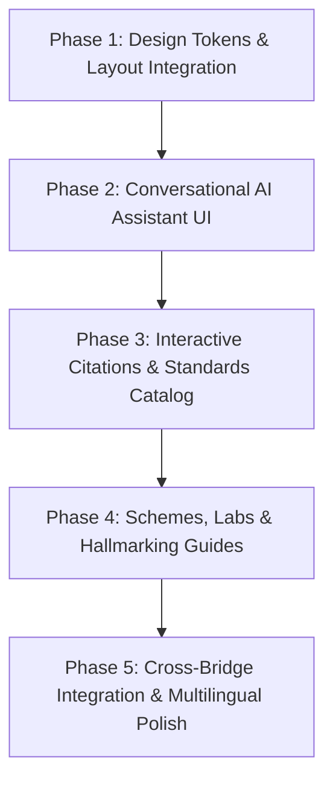

# VeriQO PS107: Frontend Architecture Audit & Target Analysis

**Document Version:** 1.0.0  
**Author:** Sunny (Dev 1 — Frontend Developer)  
**Project:** VeriQO — AI-Assisted Legal Metrology & Standards Compliance Platform  
**Target Challenge:** Smart India Hackathon (SIH) Problem Statement 107 (PS107)  
**Git Branch:** `feature/ps107-frontend`  
**Status:** Read-Only Audit & Architectural Blueprint (No Application Code Modified)

---

## Executive Summary

VeriQO is an operational, full-stack Next.js application built to enforce compliance with the **Legal Metrology Act, 2009** and the **Legal Metrology (Packaged Commodities) Rules, 2011**. It currently features multi-image packaging uploads, OCR and vision-based statutory declaration extraction, a deterministic legal rule engine, e-commerce price and listing cross-verification, formal authority inspection workflows with role-based access control (RBAC), risk prioritization queues, consumer complaint tracking, and automated PDF report generation.

**SIH Problem Statement 107 (PS107)** requires expanding this foundation to incorporate an **AI Conversational Assistant for Indian Standards and Bureau of Indian Standards (BIS) Regulations**. This assistant must guide consumers, manufacturers, and enforcement officers on:
- Indian Standards (IS codes and specifications)
- Applicable standards matching product descriptions
- BIS certification schemes (ISI Mark Scheme I, Compulsory Registration Scheme CRS Scheme II, Foreign Manufacturers Scheme FMCS, Hallmarking)
- Certification procedures, documentation, and licensing guidance
- Testing requirements, laboratory parameters, and accredited testing facilities
- Hallmarking standards (IS 1417, IS 2112) and HUID verification
- Multilingual interactions (English, Hindi, and regional Indian languages) with source-backed citations and clause references

This document establishes the frontend architecture audit of the existing codebase, specifies how existing components and layouts will be preserved and extended, outlines missing screens and UI primitives, defines backend/AI API requirements, sets team file ownership boundaries, and details the phased implementation roadmap.

---

## 1. Repository & Frontend Architecture Audit

A complete read-only audit of the existing repository was performed across all 23 required dimensions.

### 1.1 Project Structure
The repository is structured as a modern Next.js App Router application with strict role isolation and domain separation:
```
VeriQO/
├── .env.example                # Canonical environment variable specifications
├── next.config.js              # Next.js build and runtime configuration
├── package.json                # Project dependencies and build scripts
├── tsconfig.json               # TypeScript compiler options (@/* path aliases)
├── prisma/
│   ├── schema.prisma           # Complete PostgreSQL schema (13 models, 12 enums)
│   └── seed.ts                 # Database seed scripts for RBAC testing
├── scripts/                    # Test suites for Phase 3A, 3B, 3C, and 4A
├── src/
│   ├── middleware.ts           # Layer 1 RBAC route gatekeeper (NextAuth v5)
│   ├── app/
│   │   ├── layout.tsx          # Root HTML layout with SessionProvider & Toaster
│   │   ├── page.tsx            # Public marketing landing page
│   │   ├── unauthorized/       # 403 Forbidden error page
│   │   ├── (auth)/             # Authentication route group (Login, Register)
│   │   ├── (consumer)/         # Consumer portal route group (/consumer/*)
│   │   ├── (authority)/        # Authority portal route group (/authority/*)
│   │   ├── (admin)/            # Admin portal route group (/admin/*)
│   │   └── api/                # Next.js App Router API route handlers
│   │       ├── auth/           # NextAuth route handler ([...nextauth])
│   │       └── v1/             # Versioned REST APIs for platform operations
│   ├── components/
│   │   ├── ui/                 # Design token UI primitives (Button, Card, Badge, Modal...)
│   │   ├── layout/             # Layout components (PortalShell, Navbar, Sidebar, PageHeader)
│   │   ├── consumer/           # Consumer domain components (ComplaintForm, ScanUploadZone)
│   │   ├── authority/          # Authority domain components (InspectionCard, InspectionWorkflow)
│   │   ├── admin/              # Admin domain components (UserTable, RuleTable, CreateUserModal)
│   │   └── risk/               # Risk intelligence components (RiskBadge, RiskAssessmentCard)
│   ├── hooks/                  # Custom React hooks (useCurrentUser)
│   ├── lib/                    # Server-side utilities, services, ORM client, and analyzers
│   ├── styles/                 # Pure CSS design system (tokens.css, globals.css, CSS modules)
│   └── types/                  # Shared TypeScript interfaces and domain definitions
```

### 1.2 Frontend Framework
- **Next.js:** Version `14.2.35` utilizing the **App Router**.
- **Rendering Strategy:** Hybrid architecture. Server Components (RSC) handle initial data fetching directly via Prisma ORM or internal services (`async function Page()`), serializing clean JSON props to interactive Client Components (`'use client'`).
- **React:** Version `18.3.1` (concurrent features, streaming, suspense boundaries).

### 1.3 Build Tool & Tooling
- **Compiler:** Next.js SWC compiler (`next build`, `next dev`).
- **Linter:** ESLint 8.57.1 with `eslint-config-next` 14.2.35.
- **Type Checker:** TypeScript 5.9.3 running in strict mode (`tsc --noEmit`).
- **Execution Helper:** `tsx` 4.23.13 for standalone script execution and database seeding.

### 1.4 package.json Dependencies
The package manifests are clean with zero unnecessary bloat:
- `@auth/prisma-adapter` (`^2.11.3`) & `next-auth` (`^5.0.0-beta.32`): Modern Auth.js v5 authentication.
- `@google/generative-ai` (`^0.24.1`): Server-side Gemini Vision and OCR processing.
- `@prisma/client` (`^5.22.0`): PostgreSQL type-safe database client.
- `bcryptjs` (`^3.0.3`): Password hashing.
- `lucide-react` (`^1.41.0`): Standardized SVG icon system.
- `pdfkit` (`^0.20.2`): Server-side PDF report compilation.
- `react-dropzone` (`^20.1.1`): Multi-file drag-and-drop file upload.
- `react-hook-form` (`^7.87.0`): High-performance form state management.
- `react-hot-toast` (`^2.6.0`): Reactive toast notification dispatch.
- `recharts` (`^3.10.1`): SVG chart visualizations for authority and admin dashboards.
- `winston` (`^3.19.0`): Structured application and audit logging.
- `zod` (`^4.5.4`): Runtime schema validation.

### 1.5 Entry Points
1. **Root HTML Entry:** `src/app/layout.tsx` wraps all child routes with `<SessionProvider>` and `<Toaster position="top-right">` configured with design tokens.
2. **Public Home:** `src/app/page.tsx` renders the marketing hero, compliance chain breakdown, Legal Metrology foundation notice, and authentication redirects.
3. **Auth Entry:** `src/app/(auth)/login/page.tsx` handles role-based credential logins with developer credential reference cards.
4. **Portal Layouts:** `src/app/(consumer)/layout.tsx`, `src/app/(authority)/layout.tsx`, and `src/app/(admin)/layout.tsx` serve as layout entry points that read the active session and inject user metadata into `<PortalShell>`.

### 1.6 Routes
- **Public Routes:** `/`, `/login`, `/register`, `/unauthorized`, `/api/auth/*`.
- **Consumer Routes:**
  - `/consumer/dashboard` — Personal scan metrics, quick actions, recent uploads.
  - `/consumer/scan` — Drag-and-drop multi-image packaging scanner and OCR initiation.
  - `/consumer/scans/[id]` — Detailed packaging dossier with extracted declarations, OCR raw view, e-commerce cross-check, and complaint filing trigger.
  - `/consumer/complaints` — My complaints tracking table with safe state projection.
  - `/consumer/complaints/new` — File statutory complaint form linked to scan/product.
  - `/consumer/complaints/[id]` — Complaint timeline and official updates.
  - `/consumer/history` — Chronological scan history with thumbnail previews.
- **Authority Routes:**
  - `/authority/dashboard` — Supervisory dashboard with inspection analytics, decision breakdowns, violation distributions, and online verification consistency.
  - `/authority/scan` — Officer-driven physical packaging scanner linked to inspections.
  - `/authority/cases` & `/authority/cases/[id]` — Regulatory case management dockets.
  - `/authority/risk` — Prioritized risk queue ranking dockets based on violations and grievances.
  - `/authority/inspections` — Inspection docket listing with status and role filters.
  - `/authority/inspections/new` — Docket creation wizard.
  - `/authority/inspections/[id]` — Official statutory inspection dossier with interactive action toolbar, compliance check traces, evidence timeline, and decision recording.
  - `/authority/complaints` — Consumer complaint intake and investigation conversion.
  - `/authority/search` — Unified multi-entity search (cases, complaints, inspections, products, manufacturers, brands, violations).
  - `/authority/search/brands/[name]`, `/authority/search/manufacturers/[name]`, `/authority/search/products/[id]`, `/authority/search/violations/[id]` — Deep investigation entity detail views.
- **Admin Routes:**
  - `/admin/dashboard` — Platform overview and capability readiness status.
  - `/admin/users` — User management and RBAC role assignment.
  - `/admin/rules` — Versioned Legal Metrology rule engine configuration table.
  - `/admin/audit-logs` — Immutable audit log viewer with timestamp and IP traces.

### 1.7 Pages
Pages are split cleanly between Server Components (fetching data and checking server-side authentication) and Client Components (rendering interactive forms, toolbars, and modals). Examples:
- `src/app/(consumer)/consumer/scans/[id]/page.tsx` (RSC) $\to$ `ScanDetailClient.tsx` (Client).
- `src/app/(authority)/authority/inspections/[id]/page.tsx` (RSC) $\to$ `InspectionReviewContent.tsx` (Client).
- `src/app/(authority)/authority/risk/page.tsx` (RSC) $\to$ `RiskQueueClient.tsx` (Client).
- `src/app/(authority)/authority/search/page.tsx` (RSC) $\to$ `SearchClient.tsx` (Client).

### 1.8 Components Architecture
Components follow an atomic and domain-driven design:
- **`components/ui/`**: Base UI primitives independent of domain logic.
- **`components/layout/`**: Shell, top navigation, sidebar, and breadcrumbs.
- **`components/consumer/`**: Consumer-domain components (ComplaintForm, ScanUploadZone).
- **`components/authority/`**: Authority-domain components (InspectionCard, InspectionWorkflow).
- **`components/admin/`**: Admin-domain components (UserTable, RuleTable, CreateUserModal).
- **`components/risk/`**: Risk intelligence components (RiskBadge, RiskAssessmentCard).

### 1.9 Layouts System
- The global layout framework is encapsulated in `PortalShell.tsx`.
- Desktop: Fixed sidebar (`260px` wide) with top sticky navbar (`64px` high) and main scrollable content area (`max-width: 1400px`).
- Mobile: Responsive slide-out drawer with blur backdrop overlay triggered via a hamburger toggle button in `Navbar.tsx`.
- Role Awareness: The sidebar dynamically switches menu items, icons, and portal branding colors based on the user's authenticated `Role` (`CONSUMER`, `AUTHORITY_OFFICER`, `SENIOR_AUTHORITY`, `ADMIN`).

### 1.10 Styling System
- **Approach:** Pure Vanilla CSS Modules powered by CSS Custom Properties (Design Tokens).
- **Design Tokens (`tokens.css`):**
  - Brand Palette: Dark Navy theme (`--brand-50` to `--brand-950`, base page background `#0f172a`, card surfaces `#1e293b`, elevated panels `#273549`, inputs `#1a2a3f`).
  - Semantic Status Tokens: Success (`#10b981`), Warning (`#f59e0b`), Error (`#ef4444`), Info (`#6366f1`).
  - Typography: Inter typeface with predefined sizing tokens (`--text-xs` to `--text-5xl`) and weight tokens.
  - Spacing & Radii: Consistent 4px grid scale (`--space-1` to `--space-24`) and radius tokens (`--radius-sm` to `--radius-full`).
- **Global Styles (`globals.css`):** Reset rules, accessible focus visible states (`--border-focus`), custom dark scrollbars, utility classes (`.hover-card`, `.glass`, `.gradient-text`, `.portal-layout`), and animations (`fadeIn`, `slideIn`, `spin`).
- **Component Modules:** Isolated CSS classes in `*.module.css` files preventing style leakage.
- **Tailwind Absence:** The codebase does NOT use Tailwind CSS. All styles are cleanly written with CSS custom properties and CSS modules.

### 1.11 State Management
- **Server State:** Handled natively by Next.js App Router (RSC fetch, caching, revalidation via `router.refresh()`).
- **Client UI State:** Managed with React standard hooks (`useState`, `useCallback`, `useMemo`, `useTransition`).
- **URL Parameter State:** Search filters, active tabs, pagination, and sorting are synchronized with URL query strings via `useSearchParams` and `useRouter` (e.g., in `RiskQueueClient.tsx` and `SearchClient.tsx`).
- **User Session State:** Handled by NextAuth `<SessionProvider>` and `useCurrentUser()` hook.
- **Notifications:** Global reactive toast state via `react-hot-toast`.

### 1.12 API / Service Layer
- Handlers in `src/app/api/v1/*` accept requests, authenticate using `requireRole()` from `api-helpers.ts`, invoke encapsulated business services in `src/lib/*`, and return standardized JSON:
  ```typescript
  // Success: { success: true, data: T }
  // Error:   { success: false, error: string }
  ```
- Client components consume these endpoints via native `fetch()` calls inside async action handlers.

### 1.13 Authentication UI
- NextAuth v5 credentials provider with JWT session strategy.
- Sign-in page at `/login` provides validation, animated loading indicators, and developer credential shortcuts in development mode.
- Registration page at `/register` provisions `CONSUMER` accounts with automated post-registration redirection.
- Session sign-out is integrated directly in the sidebar footer with callback routing.

### 1.14 Dashboards
- **Consumer Dashboard:** Personal scan total, complaints filed, quick action shortcuts, recent upload list with product thumbnails.
- **Authority Dashboard:** Real-time supervisory KPI cards, officer decision distribution, violation breakdown by severity, online listing audit statistics, top violated Legal Metrology rules, and 6-month monthly trends.
- **Admin Dashboard:** Total user count, legal rule catalog count, total inspections, audit events, and core system capability status indicators.

### 1.15 Product / Package Upload UI
- `ScanUploadZone.tsx` and `/consumer/scan/page.tsx` utilize `react-dropzone` supporting up to 10 packaging photographs (max 20MB each) across JPG, PNG, WebP, and HEIC formats.
- Previews feature thumbnail cards with byte sizes, removal buttons, and live upload progress bars.
- Multi-phase animated visual stepper: `Uploading Images` $\to$ `Extracting Text via OCR` $\to$ `Analyzing Mandatory Declarations` $\to$ `Analysis Complete`.

### 1.16 OCR / Compliance UI
- `ScanDetailClient.tsx` displays the complete extraction dossier:
  - 14 statutory declaration fields (MRP, Net Quantity, Dates, Manufacturer, Packer, Country of Origin, Customer Care, etc.).
  - Confidence indicators, detection status tags, and verbatim packaging snippets.
  - Collapsible raw OCR text modal with one-click clipboard copying.
  - E-Commerce price and listing verification module comparing physical packaging MRP against live online product listings.
  - Direct deep link to prefill and submit a statutory complaint.

### 1.17 Reports UI
- Authority dossier features an integrated report generation workflow via `InspectionActionToolbar.tsx`.
- Calls `POST /api/v1/inspections/[id]/report` to assemble a cryptographic evidence snapshot, compile an official PDF using `pdfkit`, and store it via `StorageService`.
- Exposes direct download links with SHA-256 security hashes and public verification reference IDs.

### 1.18 Admin UI
- `/admin/users`: User table listing names, emails, roles, and status; modal for inviting and provisioning authority officers.
- `/admin/rules`: Legal rule table listing rule numbers (Rule 6, Rule 9, etc.), category, severity, applicability, and active revision status.
- `/admin/audit-logs`: Comprehensive timeline of all administrative and enforcement actions.

### 1.19 Consumer UI
- Consumer-facing portal features clear, transparent terminology.
- `ConsumerSafeStatusBadge` abstracts complex internal authority case state transitions into consumer-friendly statuses: `Complaint Submitted`, `Under Review`, `Assigned for Investigation`, `Investigation in Progress`, `Decision Pending`, and `Resolved`.

### 1.20 Existing Reusable Components
- `Button` (`primary`, `secondary`, `ghost`, `danger`, `success`, 5 sizes, loading spinners).
- `Card`, `CardHeader`, `CardTitle`, `CardBody`, `CardFooter`, `StatCard`.
- `Badge` (with 11 specialized variants: `ComplianceBadge`, `InspectionStatusBadge`, `ComplaintStatusBadge`, `CaseStatusBadge`, `ConsumerSafeStatusBadge`, `CasePriorityBadge`, `RoleBadge`, `ScanStatusBadge`, `IdentificationStatusBadge`, `AuthorityDecisionBadge`, `ViolationSeverityBadge`).
- `Input`, `Textarea`, `Select` (accessible, error message and icon slot support).
- `Modal` (backdrop blur, escape key listener, scroll locking).
- `Table` (generic typed columns, custom row renderers, empty and loading states).
- `EmptyState` (standardized empty graphics and call-to-action buttons).
- `Spinner` (CSS/SVG keyframe loader).
- `PortalShell`, `Navbar`, `Sidebar`, `PageHeader`.
- `RiskBadge`, `RiskAssessmentCard`.

### 1.21 Existing API Endpoints Consumed by Frontend
- Authentication: `/api/auth/[...nextauth]`, `/api/v1/users/register`.
- Uploads & Files: `/api/v1/upload`, `/api/v1/files/[...key]`.
- Scans & OCR: `/api/v1/scans`, `/api/v1/scans/[id]`, `/api/v1/scans/[id]/process`, `/api/v1/authority/scans`, `/api/v1/authority/scans/[id]/process`.
- Inspections: `/api/v1/inspections`, `/api/v1/inspections/[id]`, `/api/v1/inspections/[id]/analyze`, `/api/v1/inspections/[id]/decision`, `/api/v1/inspections/[id]/evidence`, `/api/v1/inspections/[id]/report`, `/api/v1/inspections/[id]/timeline`, `/api/v1/inspections/[id]/traceability/[checkId]`.
- Cases & Complaints: `/api/v1/cases`, `/api/v1/cases/[id]`, `/api/v1/complaints`, `/api/v1/consumer/complaints`, `/api/v1/consumer/complaints/[id]`.
- Risk & Analytics: `/api/v1/authority/risk`, `/api/v1/analytics/authority`, `/api/v1/products/[id]/risk`.
- Search: `/api/v1/authority/search`, `/api/v1/authority/search/*`.
- Online Verification: `/api/v1/online-verification`.
- Administration: `/api/v1/users`, `/api/v1/rules`, `/api/v1/audit-logs`.

### 1.22 Existing Environment & Configuration
- Documented in `.env.example`:
  - `DATABASE_URL` (PostgreSQL connection string).
  - `NEXTAUTH_SECRET`, `NEXTAUTH_URL` (Auth.js session encryption).
  - `STORAGE_PROVIDER` (`local` or `s3`), `LOCAL_STORAGE_PATH`.
  - `GEMINI_API_KEY` (server-side vision & extraction).
  - `SEARCH_API_KEY` (server-side online verification).
  - `NEXT_PUBLIC_APP_NAME`, `NEXT_PUBLIC_APP_VERSION`.

### 1.23 Existing Error & Loading States
- Multi-step loading spinners and progress steppers during image analysis.
- Inline alert boxes (`AlertCircle`, `AlertTriangle`) for recoverable network errors and API key warnings with clear remediation steps.
- Empty states (`EmptyState.tsx`) for collections, search results, and dossiers without records.
- Button-level loading states disabling multiple clicks and rendering SVG spinners.

---

## 2. Comparison Against Target: SIH PS107 & VeriQO Vision

The Smart India Hackathon PS107 challenge demands an **AI Conversational Assistant for Indian Standards & BIS Regulations**. While VeriQO provides an industry-leading implementation for Legal Metrology (packaged commodities), it currently lacks dedicated user interfaces for Indian Standards (IS), BIS certification schemes, testing laboratories, hallmarking, and natural-language conversational queries.

The table below maps existing VeriQO features against PS107 requirements:

| Domain / Requirement | VeriQO Existing Status | PS107 Requirement | Gap & Target Upgrade |
| :--- | :--- | :--- | :--- |
| **Legal Metrology (LMPC)** | ✅ Complete (Rules 2011, deterministic engine, 14 declarations) | Preserve completely | Maintain existing routes and components without regression |
| **Conversational AI Assistant** | ❌ None (only point-in-time scanning) | Multi-turn AI assistant for Indian Standards & BIS | Build full-screen chat UI, thread manager, streaming token parser |
| **Indian Standards Catalog** | ❌ None | IS numbers, product standards, clauses | Build Standards Explorer, clause inspector, search by product |
| **BIS Certification Schemes** | ❌ None | ISI Mark, CRS, FMCS, Hallmarking guidance | Build Scheme Explorer, step-by-step roadmap, fee calculators |
| **Testing Laboratories** | ❌ None | Directory of BIS/NABL accredited test labs | Build Lab Locator with standard/state/city filters |
| **Hallmarking & HUID** | ❌ None | Purity standards, 6-digit HUID check, consumer rights | Build Hallmarking & HUID inspection/verification UI |
| **Multilingual Interaction** | ❌ English only | Hindi + regional Indian languages | Build Language selector, multilingual prompt support |
| **Voice Interface** | ❌ Text/Upload only | Speech-to-text input & text-to-speech audio reader | Build Web Speech API mic toggle & audio response reader |
| **Source-Backed Citations** | ⚠️ Partial (DB rule numbers in inspection) | Exact IS clauses, Gazette notifications, official URLs | Build interactive `CitationBadge` & `CitationPopover` cards |
| **Product $\leftrightarrow$ Standards Bridge** | ❌ None | Map scanned packaged product to mandatory IS standard | Add "Applicable BIS Standards" tab in scan dossier |

---

## 3. Comprehensive Determination (Items A through K)

### A. What Already Exists?
1. **Full Authentication & RBAC System:** NextAuth v5 session management, middleware route gatekeeper, login and registration interfaces.
2. **Packaged Commodity Scanner:** Dropzone multi-file image uploader with preview grid, progress animations, and storage abstraction.
3. **Extraction & Inspection Dossier:** Display of 14 statutory packaging declarations, raw OCR viewer, and image gallery.
4. **Deterministic Compliance Rule Engine:** Data-driven rule evaluator with condition traces and severity grading.
5. **E-Commerce Verification Module:** Physical MRP vs. online listing price audit with discrepancy highlighting.
6. **Authority Inspection Dossier:** Status transition toolbar, evidence trail, observation notes modal, official decision recorder, and PDF report generator.
7. **Investigation & Prioritization Infrastructure:** Risk scoring queue, multi-entity search, case management, and consumer complaint tracking.
8. **Design System:** Navy dark theme design tokens (`tokens.css`), responsive layout shell (`PortalShell.tsx`), and UI primitives.

### B. What Can Be Reused?
1. **Layout Infrastructure:** `PortalShell`, `Sidebar`, `Navbar`, and `PageHeader` provide the container for all new PS107 screens.
2. **UI Primitives:** `Button`, `Card`, `StatCard`, `Badge`, `Input`, `Textarea`, `Select`, `Modal`, `Table`, `EmptyState`, and `Spinner` will directly build the new assistant and catalog screens.
3. **Authentication & Session Hooks:** `useCurrentUser`, NextAuth session provider, and role checks.
4. **Storage & File APIs:** Existing `/api/v1/upload` and `/api/v1/files/*` can be reused if the user uploads product spec sheets or lab test certificates for AI analysis.
5. **Toast Notification System:** `react-hot-toast` integration.
6. **Design System Tokens:** Strict reuse of CSS custom properties ensuring visual consistency across all portals.

### C. What Frontend Functionality Is Missing?
1. **Conversational Assistant UI:** Chat message stream, streaming response renderer, chat history drawer, suggested prompt pills, and auto-scrolling message view.
2. **Interactive Clause Citations:** Citation chips embedded inside assistant messages that open popovers or modals displaying standard clauses, official wording, and gazette links.
3. **Indian Standards Directory & Search:** Search bar by IS code (e.g., "IS 1061"), product keyword (e.g., "drinking water", "cement", "battery"), or industry sector, with filter by mandatory Quality Control Order (QCO) status.
4. **BIS Certification Scheme Walkthroughs:** Interactive guides for Scheme I (ISI Mark), Scheme II (CRS), Scheme X (FMCS), and Hallmarking detailing application steps, required documentation, and testing phases.
5. **Testing Laboratory Directory:** Searchable laboratory catalog filtered by Indian Standard, state, city, and accreditation validity.
6. **Hallmarking & HUID Checker:** Visual verification tool explaining gold/silver purity stamps (e.g., 916 for 22K), BIS logo, assaying center marks, and 6-digit alphanumeric HUID format validation.
7. **Multilingual & Voice Controls:** Language selector dropdown for Indian languages, speech-to-text microphone button, and text-to-speech audio reader.
8. **Commodity-to-Standards Cross Bridge:** Integration card inside the packaging scan dossier linking extracted packaging data to applicable mandatory Indian Standards.

### D. What Screens Need To Be Added?
1. **`/consumer/assistant` (or `/assistant`):** Main PS107 AI Conversational Assistant. Full-screen interface with thread history, prompt suggestions, streaming message bubbles, voice input, language selector, and interactive citation popovers.
2. **`/consumer/standards`:** Indian Standards Directory. Search, category filters, mandatory QCO indicators, and standard preview cards.
3. **`/consumer/standards/[isNumber]`:** Standard Detail Dossier. Standard title, scope, critical testing clauses, mandatory certification status, and linked accredited laboratories.
4. **`/consumer/schemes`:** BIS Certification Schemes Guide. Step-by-step roadmap for manufacturers and consumers explaining ISI Mark, CRS, FMCS, and Hallmarking processes.
5. **`/consumer/laboratories`:** Testing Laboratory Locator. Searchable lab directory with standard, state, and city filters.
6. **`/consumer/hallmarking`:** Hallmarking & HUID Guidance Tool. Visual guide to hallmarking marks, consumer verification guide, and HUID structure analyzer.
7. **`/authority/assistant`:** Officer Regulatory AI Copilot. Specialized authority assistant with regulatory checklist generation, standard cross-referencing, and inspection evidence drafting.

### E. What Existing Screens Should Be Extended?
1. **`src/components/layout/Sidebar.tsx`:**
   - Add navigation links for `Standards AI Assistant`, `Indian Standards`, `Certification Schemes`, `Testing Labs`, and `Hallmarking` to `consumerNav`, `authorityNav`, and `adminNav`.
2. **`src/app/page.tsx` (Landing Page):**
   - Update hero section and platform highlights to showcase VeriQO 2.0 dual capabilities: Packaged Commodities Legal Metrology + BIS Standards AI Assistant for SIH PS107.
3. **`src/app/(consumer)/consumer/dashboard/page.tsx`:**
   - Add quick action cards for "Ask Standards AI", "Lookup IS Standard", and "Verify Hallmarking/HUID".
4. **`src/app/(consumer)/consumer/scans/[id]/ScanDetailClient.tsx`:**
   - Add an **"Applicable Indian Standards (BIS)"** section below the Legal Metrology declarations, displaying AI-recommended IS codes and mandatory QCO compliance flags for the scanned commodity.
5. **`src/app/(authority)/authority/inspections/[id]/InspectionReviewContent.tsx`:**
   - Extend the officer dossier with a **"Quality Control Order (QCO) & BIS Certification Check"** card, allowing officers to check whether the product requires mandatory ISI/CRS licensing.
6. **`src/app/(authority)/authority/search/SearchClient.tsx`:**
   - Add `STANDARDS` and `LABORATORIES` to the `ENTITY_TABS` array for unified search.

### F. What Reusable Components Should Be Created?
1. **`ChatInterface` (`src/components/assistant/ChatInterface.tsx`):** Complete chat container managing conversation thread, message streaming, auto-scrolling, and error boundaries.
2. **`ChatMessageItem` (`src/components/assistant/ChatMessageItem.tsx`):** Renders user and assistant messages with markdown parsing, code blocks, copy action, and audio playback.
3. **`CitationBadge` & `CitationModal` (`src/components/assistant/CitationBadge.tsx`):** Inline citation tag (e.g. `[IS 14543:2016 Cl 5.1]`) that triggers an interactive popup displaying standard title, clause text, and official document link.
4. **`PromptSuggestions` (`src/components/assistant/PromptSuggestions.tsx`):** Clickable starter prompts categorized by consumer, manufacturer, and technical topics.
5. **`VoiceInputButton` (`src/components/assistant/VoiceInputButton.tsx`):** Microphone control integrating browser Web Speech API with audio wave animation and manual fallback.
6. **`LanguageSelector` (`src/components/assistant/LanguageSelector.tsx`):** Dropdown supporting English, Hindi, and regional languages (Tamil, Telugu, Bengali, Marathi, Gujarati, Kannada, etc.).
7. **`StandardCard` (`src/components/standards/StandardCard.tsx`):** Card displaying IS standard number, title, category, mandatory QCO badge, and view details action.
8. **`SchemeStepWizard` (`src/components/schemes/SchemeStepWizard.tsx`):** Multi-step visual progress stepper for certification procedures and documentation requirements.
9. **`LabCard` (`src/components/labs/LabCard.tsx`):** Directory card displaying laboratory name, accreditation details, location, and test capabilities.
10. **`FloatingAssistantWidget` (`src/components/assistant/FloatingAssistantWidget.tsx`):** Global floating quick-chat launcher accessible across all portal screens.

### G. What Backend APIs Will The Frontend Need?
The frontend will require the following endpoints from Backend Dev:
1. `GET /api/v1/assistant/conversations` — Retrieve past conversation threads for the authenticated user.
2. `POST /api/v1/assistant/conversations` — Create a new conversation thread.
3. `GET /api/v1/assistant/conversations/[id]` — Fetch messages for a specific conversation thread.
4. `DELETE /api/v1/assistant/conversations/[id]` — Delete a conversation thread.
5. `GET /api/v1/standards` — Search/filter Indian Standards (`?q=...&category=...&mandatory=true&page=1`).
6. `GET /api/v1/standards/[code]` — Get full details of an Indian Standard with clauses and testing parameters.
7. `GET /api/v1/certification-schemes` — Retrieve structured details for ISI, CRS, FMCS, and Hallmarking schemes.
8. `GET /api/v1/laboratories` — Search testing laboratories by IS code, location, or accreditation.
9. `POST /api/v1/standards/match-product` — Post product name/category/scanId and receive matched Indian Standards and QCO status.
10. `GET /api/v1/hallmarking/guidelines` — Retrieve hallmarking guidelines and HUID structure information.

### H. What AI APIs Will The Frontend Need?
The frontend will require the following AI/ML capabilities from AI Dev:
1. `POST /api/v1/assistant/chat` (Streaming / SSE): Conversational endpoint accepting conversation ID, user query, language, and role context; streaming back token chunks with structured citation metadata.
2. **Semantic Product $\leftrightarrow$ Standard Matcher:** Given product declarations or text from a scan, return matched IS codes with similarity scores and mandatory QCO flags.
3. **Multilingual Translation / Reasoning Pipeline:** Translating regional language user prompts and generating responses in the requested Indian language.
4. **Citation Extraction Engine:** Grounding answers in verified BIS source documents and returning structured citation objects:
   ```typescript
   interface Citation {
     standardNumber: string;     // e.g. "IS 1061:1997"
     clauseNumber: string;       // e.g. "Clause 5.2"
     title: string;              // e.g. "Disinfectant Fluids — Specification"
     excerpt: string;            // Official text snippet
     sourceDocumentUrl?: string; // Link to official Gazette or standard page
   }
   ```
5. **Speech Synthesis / Recognition Support:** Seamless integration with standard browser Web Speech APIs or an optional AI audio transcription endpoint.

### I. Which Files Should Sunny (Frontend Dev) Own?
Sunny owns all user-facing pages, UI components, layout structures, styles, client hooks, and frontend types:
- **Routes & Pages:**
  - `src/app/page.tsx`, `src/app/layout.tsx`, `src/app/unauthorized/page.tsx`
  - All existing and new pages under `src/app/(consumer)/*`
  - All existing and new pages under `src/app/(authority)/*`
  - All existing pages under `src/app/(admin)/*`
  - All existing pages under `src/app/(auth)/*`
- **Components:**
  - `src/components/ui/*` (all UI primitives)
  - `src/components/layout/*` (`PortalShell`, `Sidebar`, `Navbar`, `PageHeader`)
  - `src/components/consumer/*`
  - `src/components/authority/*`
  - `src/components/admin/*`
  - `src/components/risk/*`
  - **New component modules:** `src/components/assistant/*`, `src/components/standards/*`, `src/components/schemes/*`, `src/components/labs/*`, `src/components/hallmarking/*`
- **Styles:**
  - `src/styles/tokens.css`, `src/styles/globals.css`, and all `*.module.css` files
- **Frontend Hooks & Types:**
  - `src/hooks/*`
  - `src/types/assistant.ts`, `src/types/standards.ts`, and frontend type definitions

### J. Which Files Should Sunny NOT Touch?
Sunny must NOT touch backend services, database schema, migrations, or internal AI model implementations:
- **Database & Persistence:**
  - `prisma/schema.prisma` (Database models & enums — owned by Backend Dev)
  - `prisma/seed.ts` & `prisma/migrations/*`
  - `src/lib/prisma.ts`
- **Backend Services & Engines:**
  - `src/lib/inspections/*` (`inspection-service.ts`, `pdf-service.ts`, `report-generator.ts`, `analytics-service.ts`)
  - `src/lib/cases/*` (`case-service.ts`)
  - `src/lib/consumer/*` (`consumer-document-service.ts`, `consumer-pdf-service.ts`)
  - `src/lib/rules/*` (`rule-engine.ts`, `condition-evaluator.ts`, `operators.ts`, `legal-rules-data.ts`)
  - `src/lib/risk/*` (`risk-service.ts`)
  - `src/lib/online/*` (`verification-service.ts`, `comparator.ts`, providers)
  - `src/lib/search/*` (`search-service.ts`)
  - `src/lib/storage.ts`, `src/lib/audit.ts`, `src/lib/api-helpers.ts`
- **AI / Vision Pipeline:**
  - `src/lib/ai/*` (`gemini-analyzer.ts`, `heuristic-analyzer.ts`)
  - `src/lib/ocr/*` (`gemini-ocr.ts`, `fallback-ocr.ts`)
  - `src/lib/pipeline/*` (`process-scan.ts`)
- **API Route Handlers:**
  - `src/app/api/v1/*` (implemented and maintained by Backend Dev)
- **Configuration & Lockfiles:**
  - `package.json`, `package-lock.json` (until dependencies are formally approved)
  - `next.config.js`, `tsconfig.json`

### K. Integration Risks With Backend Dev and AI Dev

1. **Streaming Protocol vs. Non-Streaming Latency:**
   - *Risk:* Conversational AI queries can take 6–12 seconds to generate full responses with citations. If Backend/AI Dev implements a traditional JSON REST endpoint without streaming, users will face blank screens or frozen loading spinners.
   - *Mitigation:* Agree on a Server-Sent Events (SSE) or `ReadableStream` protocol (`POST /api/v1/assistant/chat`) early. The frontend will consume chunks incrementally using `fetch` with `response.body.getReader()`.

2. **Unstructured AI Citations:**
   - *Risk:* If the AI model returns raw unstructured markdown (e.g. *"As per IS 1061..."*) without structured metadata, the frontend cannot render clickable citation chips, verification popovers, or direct links to official documents.
   - *Mitigation:* Require the AI service to output structured citation objects or clean delimiter blocks (e.g., `[[CITATION:IS_1061:Cl_5.2]]`) alongside the generated text.

3. **Multilingual Output & Token Budget Overhead:**
   - *Risk:* Generating responses directly in regional Indian languages (e.g., Tamil, Telugu, Bengali) with dense technical vocabulary can cause high token usage, slow output rates, or inaccurate terminology for technical tolerances.
   - *Mitigation:* AI Dev should maintain a curated glossary of standard BIS terms across Indian languages and ensure system prompts strictly preserve standard numeric values and clause designations.

4. **Speech-to-Text Browser Inconsistencies:**
   - *Risk:* The browser Web Speech API (`SpeechRecognition`) is natively supported in Chromium (Chrome, Edge) but has inconsistent support in Firefox and Safari.
   - *Mitigation:* Frontend will implement graceful capability detection. If `window.SpeechRecognition` is unavailable, the voice button will display an informative tooltip and direct the user to text input.

5. **Prisma Model & DTO Synchronization:**
   - *Risk:* When Backend Dev creates database models for conversations, standards, and laboratories, any divergence in field naming between backend responses and frontend TypeScript interfaces will cause runtime errors.
   - *Mitigation:* Define shared TypeScript contracts in `src/types/assistant.ts` and `src/types/standards.ts` before writing frontend components.

6. **Preservation of Legal Metrology Functions:**
   - *Risk:* Modifying shared navigation, layouts, or scan result screens could inadvertently break existing Legal Metrology compliance checks or authority inspection workflows.
   - *Mitigation:* Treat all existing LMPC code as immutable. Add new PS107 capabilities via additive routes, components, and non-destructive tab extensions.

---

## 4. Proposed Frontend Implementation Order (Phased Roadmap)

To maintain stability while delivering the full PS107 target, frontend development will proceed in 5 sequential phases:



### Phase 1: Navigation, Design Tokens & Layout Integration
- **Objective:** Integrate new PS107 navigation routes into the existing shell without touching application logic.
- **Tasks:**
  - Extend `Sidebar.tsx` with role-aware links for `AI Assistant`, `Indian Standards`, `Certification Schemes`, `Testing Labs`, and `Hallmarking`.
  - Update `src/app/page.tsx` (landing page) to showcase the dual VeriQO 2.0 vision (Legal Metrology + BIS Standards AI).
  - Verify zero visual regressions on existing consumer, authority, and admin portals.

### Phase 2: Conversational AI Assistant UI (`/consumer/assistant` & `/authority/assistant`)
- **Objective:** Build the core conversational interface for SIH PS107.
- **Tasks:**
  - Create `ChatInterface.tsx`, `ChatMessageItem.tsx`, `PromptSuggestions.tsx`, and `LanguageSelector.tsx`.
  - Implement streaming response handler with auto-scrolling and cancellation support.
  - Implement conversation history sidebar with thread switching and clear history actions.
  - Add `FloatingAssistantWidget.tsx` for platform-wide accessibility.

### Phase 3: Interactive Citations & Indian Standards Explorer (`/consumer/standards`)
- **Objective:** Provide source-backed credibility and standard browsing.
- **Tasks:**
  - Create `CitationBadge.tsx` and `CitationModal.tsx` for interactive standard clause previews.
  - Build `/consumer/standards` catalog page with search, sector filters, and mandatory QCO indicators.
  - Build `/consumer/standards/[isNumber]` detail view with scope, clauses, and required tests.
  - Integrate standards search into the authority search interface (`SearchClient.tsx`).

### Phase 4: Certification Schemes, Labs & Hallmarking Tools
- **Objective:** Guide users through procedural compliance, laboratory testing, and hallmarking.
- **Tasks:**
  - Build `/consumer/schemes` with `SchemeStepWizard.tsx` (ISI Mark, CRS, FMCS).
  - Build `/consumer/laboratories` with `LabCard.tsx` and search filters by standard and location.
  - Build `/consumer/hallmarking` with purity charts, HUID structure verification, and consumer guides.

### Phase 5: Cross-Bridge Integration, Multilingual Polish & Voice Support
- **Objective:** Unify packaging compliance with BIS standards and finalize user experience.
- **Tasks:**
  - Extend `ScanDetailClient.tsx` with an "Applicable Indian Standards (BIS)" card linking packaging data to recommended IS standards.
  - Extend `InspectionReviewContent.tsx` with a QCO verification check for authority officers.
  - Integrate `VoiceInputButton.tsx` using Web Speech API with fallback controls.
  - Run cross-browser testing (Chrome, Edge, Firefox, Safari) and verify production build.

---

## 5. Architectural Guardrails & Quality Standards

1. **Strict Read-Only Preservation:** All existing Legal Metrology rules, OCR pipelines, inspection state machines, and audit logging remain untouched.
2. **Design Token Compliance:** All new components must use CSS Custom Properties from `src/styles/tokens.css`. No inline hex colors, hard-coded pixel margins, or Tailwind classes.
3. **Dual-Layer RBAC Adherence:** Consumer features are accessible to all authenticated users; authority-only tools remain guarded by `requireRole(['AUTHORITY_OFFICER', 'SENIOR_AUTHORITY', 'ADMIN'])`.
4. **Zero-Decisional AI Rule:** The conversational assistant and AI tools are strictly advisory and informational. Final enforcement decisions remain under the exclusive authority of authorized officers.
5. **Clean TypeScript Compilations:** Zero `any` casts in public component props; all pages must compile cleanly under `tsc --noEmit`.

---
*End of Analysis Document — Proceed to review before beginning implementation.*
