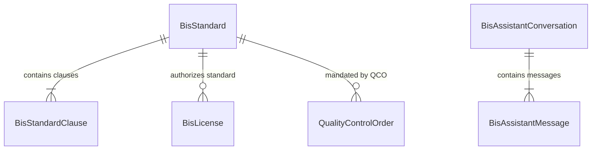

# VeriQO — PS107 Phase 1 Backend Foundation Documentation
**Document Reference**: `docs/PS107_PHASE1.md`  
**Role**: Dev 2 — Backend Developer + Integration Owner  
**Current Branch**: `feature/ps107-backend`  
**Date**: September 2026  
**Status**: Phase 1 Foundation Complete & Verified (32/32 New Tests Pass, 0 Regressions)

---

## 1. Overview & Objective

In **Phase 1 of SIH 2026 PS107**, we established the foundational backend architecture for the **AI-powered intelligent assistant for Indian Standards and BIS services**.

This implementation strictly followed the **additive-only** rule:
- Zero modifications to existing Legal Metrology rule engine logic or models.
- Zero modifications to existing authority inspection workflows, decision state machines, or PDF generation.
- Zero external live scraping or external network dependencies at this phase.
- Deterministic local mock/demo repository layer for Indian Standards, standard clauses, CML/CRS/HUID licenses, and Quality Control Orders (QCO).

---

## 2. New Database Models & Enums

The Prisma schema (`prisma/schema.prisma`) was extended with **6 new models** and **3 new `AuditAction` enum values**:

### A. New Models

1. **`BisStandard`**:
   - Stores official Indian Standards metadata.
   - Key attributes: `standardNumber` (unique, e.g. `IS 10500:2012`), `title`, `description`, `edition`, `year`, `status` (`ACTIVE`, `REVISED`, `WITHDRAWN`), `division` (`FAD`, `ETD`, `CED`, etc.), `icsCode`, `isMandatory`, `mandatedByQco`, `pdfStorageKey`, `metadata`.
   - Relations: `clauses BisStandardClause[]`, `licenses BisLicense[]`, `qcos QualityControlOrder[]`.
2. **`BisStandardClause`**:
   - Stores chunked clauses, parameter tables, and statutory limits.
   - Key attributes: `standardId`, `clauseNumber` (e.g. `4.1`, `Table 1`), `title`, `content`, `isMandatory`, `clauseType` (`SPECIFICATION`, `TEST_METHOD`, `SAFETY_REQUIREMENT`, `PACKAGING_MARKING`), `limits` (JSON structured parameter ranges), `orderIndex`.
   - Relation: `standard BisStandard @relation(fields: [standardId], references: [id], onDelete: Cascade)`.
3. **`BisLicense`**:
   - Stores BIS certification credentials across all schemes.
   - Key attributes: `licenseType` (`ISI_CML`, `CRS_REGISTRATION`, `HALLMARK_HUID`), `licenseNumber` (unique, e.g. `CM/L-8400123`, `R-41009876`, `HUID:AB12CD`), `status` (`OPERATIVE`, `EXPIRED`, `SUSPENDED`, `CANCELLED`), `standardId`, `standardNumber`, `licenseeName`, `brandName`, `factoryAddress`, `validFrom`, `validUntil`, `productCategory`, `varietyDescription`, `isDemoRecord` (boolean flag), `metadata`.
   - Relation: `standard BisStandard? @relation(fields: [standardId], references: [id], onDelete: SetNull)`.
4. **`QualityControlOrder`**:
   - Stores Ministry Gazette Quality Control Orders mandating compulsory BIS certification.
   - Key attributes: `orderTitle`, `orderNumber` (unique, e.g. `S.O. 853(E)`), `ministry`, `notifiedDate`, `effectiveDate`, `status` (`IN_FORCE`, `EXTENDED`, `SUPERSEDED`, `DRAFT`), `standardId`, `applicableProducts`, `hsCodes` (JSON array), `isExemptionApplicable`, `exemptionDetails`, `gazetteUrl`, `isDemoRecord`.
   - Relation: `standard BisStandard? @relation(fields: [standardId], references: [id], onDelete: SetNull)`.
5. **`BisAssistantConversation`**:
   - Tracks assistant dialogue sessions.
   - Key attributes: `userId` (optional, indexed), `title`, `contextStandardId`, `metadata`.
   - Relation: `messages BisAssistantMessage[]`.
6. **`BisAssistantMessage`**:
   - Individual user queries and assistant grounded replies.
   - Key attributes: `conversationId`, `role` (`USER`, `ASSISTANT`, `SYSTEM`), `content`, `citations` (JSON structured citation array), `confidenceScore`, `metadata`.
   - Relation: `conversation BisAssistantConversation @relation(fields: [conversationId], references: [id], onDelete: Cascade)`.

### B. New `AuditAction` Enum Values
- `BIS_STANDARDS_SEARCH`: Tracks citizen/officer searches in the standards catalog.
- `BIS_LICENSE_VERIFIED`: Tracks verification lookups on CML, CRS, and HUID numbers.
- `BIS_ASSISTANT_QUERY`: Tracks user queries to the standards assistant.

---

## 3. TypeScript Contracts & DTOs

Defined in [`src/types/bis.ts`](file:///c:/Users/himan/Desktop/VeriQO/src/types/bis.ts) and [`src/types/assistant.ts`](file:///c:/Users/himan/Desktop/VeriQO/src/types/assistant.ts):

### A. BIS Standards & Licensing DTOs (`src/types/bis.ts`)
- `StandardDivision`: Division identifiers (`FAD`, `ETD`, `CED`, `MED`, `TXD`, `CHTD`, etc.).
- `BisStandardItem` & `BisStandardDetail`: Catalog listing and full detail contracts.
- `BisStandardClauseDto`: Clause structure with optional structured limits array.
- `StandardSearchFilters`: Filtering parameters (`q`, `division`, `isMandatory`, `status`, `page`, `pageSize`).
- `VerifyCmlInput`, `VerifyCrsInput`, `VerifyHuidInput`: License verification inputs.
- `LicenseVerificationResult`: Normalized verification outcome (`isValid`, `status`, `licenseType`, `licenseeName`, `brandName`, `standardNumber`, `isDemoRecord`, `message`).
- `QcoCheckInput` & `QcoCheckResult`: Category and HS-code mandatory certification evaluator.
- `PackagingDualComplianceResult`: Foundation contract for merging LMPC packaging checks with BIS certification mark checks.

### B. Intelligent Assistant DTOs (`src/types/assistant.ts`)
- `CitationSource`: Exact statutory citation reference (`standardNumber`, `clauseNumber`, `title`, `excerpt`, `qcoReference`).
- `AssistantChatRequest` & `AssistantChatResponse`: Query payload and grounded response with confidence score and statutory disclaimer.
- `CitationValidationResult`: Citation verification result with list of verified vs. unverified references.
- `AssistantConversationDto` & `AssistantMessageDto`: Dialogue history contracts.

---

## 4. Service Architecture & Responsibilities

The PS107 backend domain logic is encapsulated into clean, modular services in `src/lib/bis/` and `src/lib/assistant/`:

| Service File | Class Name | Primary Responsibilities |
| :--- | :--- | :--- |
| `src/lib/bis/standards-service.ts` | `BisStandardsService` | Searches the Indian Standards catalog by keyword, standard number, or division. Queries the database first; falls back gracefully to `DEMO_STANDARDS` if database is unseeded. Resolves clauses and linked QCOs. |
| `src/lib/bis/license-service.ts` | `BisLicenseService` | Validates syntax formats and operative status for:  1. **ISI CML** (`^(?:CM\/L-?\|CML-?)?(\d{7})$`) 2. **CRS Registration** (`^(?:R-?)?(\d{8})$`) 3. **Hallmarking HUID** (`^(?:HUID:?)?([A-Z0-9]{6})$`). Queries database and mock catalog, returning typed status (`OPERATIVE`, `EXPIRED`, `INVALID_FORMAT`, `NOT_FOUND`). |
| `src/lib/bis/qco-service.ts` | `QualityControlOrderService` | Lists active Quality Control Orders in force. Checks whether a product category or HS code falls under mandatory BIS certification and identifies applicable standards. |
| `src/lib/bis/mock-data.ts` | `DEMO_STANDARDS`, `DEMO_LICENSES`, `DEMO_QCOS` | Deterministic local demo catalog ensuring offline testability and robust demo operations without external network dependencies. |
| `src/lib/assistant/citation-validator.ts` | `CitationValidator` | Authenticates that citations generated by the assistant correspond to real Indian Standards and clauses in the repository. Scans text for explicit IS references. |
| `src/lib/assistant/assistant-service.ts` | `BisAssistantService` | Resolves user queries using verified local repository knowledge. Validates citations, records conversation history in database, attaches mandatory disclaimer, and logs audit events. (Deterministic foundation ready for Gemini RAG in Phase 2/3). |

---

## 5. Seed & Demo Dataset

Created in [`scripts/seed-ps107-demo-data.ts`](file:///c:/Users/himan/Desktop/VeriQO/scripts/seed-ps107-demo-data.ts):

> [!NOTE]
> **Demo Data Transparency**: Every seeded record is explicitly flagged with `isDemoRecord: true` and labeled `[DEMO TEST RECORD]`. The system never misrepresents simulated test records as live official government data.

1. **Indian Standards**:
   - `IS 10500:2012`: Drinking Water — Specification (5 clauses: Organoleptic Table 1, General Chemical Table 2, Toxic Substances Table 3, Bacteriological Table 4, Marking Clause 5.1).
   - `IS 1293:2019`: Plugs and Socket-Outlets up to 250V / 16A (3 clauses: Standard Ratings, Marking, Electric Shock Resistance).
   - `IS 9873 (Part 1):2019`: Safety of Toys — Mechanical and Physical Properties (2 clauses: Small Parts Hazard, Marking).
   - `IS 13252 (Part 1):2010`: Information Technology Equipment — Safety (2 clauses: CRS Marking Clause 1.7, Electric Shock Protection Clause 2.1).
2. **BIS Licenses**:
   - `CM/L-8400123`: Operative ISI License under IS 10500:2012 (*Himalayan Springs Water Pvt Ltd*).
   - `CM/L-7123456`: Expired ISI License under IS 1293:2019 (*National Spark Plugs & Cables Ltd*).
   - `R-41009876`: Operative CRS Registration under IS 13252:2010 (*Apex Electronics Global Corp*).
   - `HUID:AB12CD`: Operative 6-character HUID for 22K 916 Gold Jewellery (*Tanishq Jewellers Franchise*).
3. **Quality Control Orders (QCO)**:
   - `S.O. 853(E)`: Toys (Quality Control) Order, 2020 (Mandatory ISI certification for children's toys).
   - `S.O. 3673(E)`: Plugs and Socket-Outlets (Quality Control) Order, 2021 (Mandatory ISI certification).

---

## 6. Verification Results

| Suite / Command | Execution Command | Result | Summary |
| :--- | :--- | :--- | :--- |
| **Prisma Validation** | `npx prisma validate` | **VALID** | Schema syntax, models, enums, indexes, and relations are valid |
| **Prisma Client Generation** | `npm run db:generate` | **SUCCESS** | Generated Prisma Client v5.22.0 with all 6 new models |
| **Database Sync** | `npx prisma db push` | **SYNCED** | PostgreSQL database tables and enums in sync |
| **Database Seeding** | `npx tsx scripts/seed-ps107-demo-data.ts` | **SUCCESS** | All demo standards, clauses, licenses, and QCOs seeded |
| **TypeScript Typecheck** | `npx tsc --noEmit` | **PASS (0 errors)** | Zero compilation or type errors |
| **PS107 Test Suite** | `npx tsx scripts/test-ps107-phase1-foundation.ts` | **32/32 PASS (100%)** | Standards search, CML/CRS/HUID verification, QCO checks, citations, assistant queries |
| **Phase 3A Regression** | `npx tsx scripts/test-phase3a-rule-engine.ts` | **59/59 PASS (100%)** | Legal Metrology rule engine remains 100% regression-clean |
| **Phase 4A Regression** | `npx tsx scripts/test-phase4a-inspection-workflow.ts` | **40/40 PASS (100%)** | Authority inspection workflow and RBAC remain 100% regression-clean |

---

## 7. Files Changed & Files Intentionally Untouched

### A. Files Modified / Created
- `prisma/schema.prisma` (Modified: Added 3 AuditAction values + 6 new models)
- `src/types/bis.ts` (Created: PS107 BIS domain DTOs)
- `src/types/assistant.ts` (Created: PS107 Assistant DTOs)
- `src/lib/bis/types.ts` (Created: BIS internal service types)
- `src/lib/bis/mock-data.ts` (Created: Deterministic demo repository)
- `src/lib/bis/standards-service.ts` (Created: Standards search & clause retrieval service)
- `src/lib/bis/license-service.ts` (Created: CML, CRS, HUID license verifier service)
- `src/lib/bis/qco-service.ts` (Created: Quality Control Order applicability service)
- `src/lib/assistant/types.ts` (Created: Assistant internal service types)
- `src/lib/assistant/citation-validator.ts` (Created: Statutory citation validator)
- `src/lib/assistant/assistant-service.ts` (Created: Deterministic standards assistant service)
- `scripts/seed-ps107-demo-data.ts` (Created: Database seeder for demo records)
- `scripts/test-ps107-phase1-foundation.ts` (Created: PS107 Phase 1 verification suite)
- `docs/PS107_PHASE1.md` (Created: This document)

### B. Core Files Intentionally Frozen & Untouched
- `src/lib/auth.ts` (Untouched)
- `src/lib/prisma.ts` (Untouched)
- `src/lib/storage.ts` (Untouched)
- `src/lib/audit.ts` (Untouched)
- `src/lib/rules/rule-engine.ts` (Untouched)
- `src/lib/rules/operators.ts` (Untouched)
- `src/lib/rules/condition-evaluator.ts` (Untouched)
- `src/lib/rules/applicability-evaluator.ts` (Untouched)
- `src/lib/rules/seed/legal-rules-data.ts` (Untouched)
- `src/lib/inspections/inspection-service.ts` (Untouched)
- `src/lib/inspections/pdf-service.ts` (Untouched)
- `src/lib/cases/case-service.ts` (Untouched)
- All existing 14 test scripts (Untouched)
